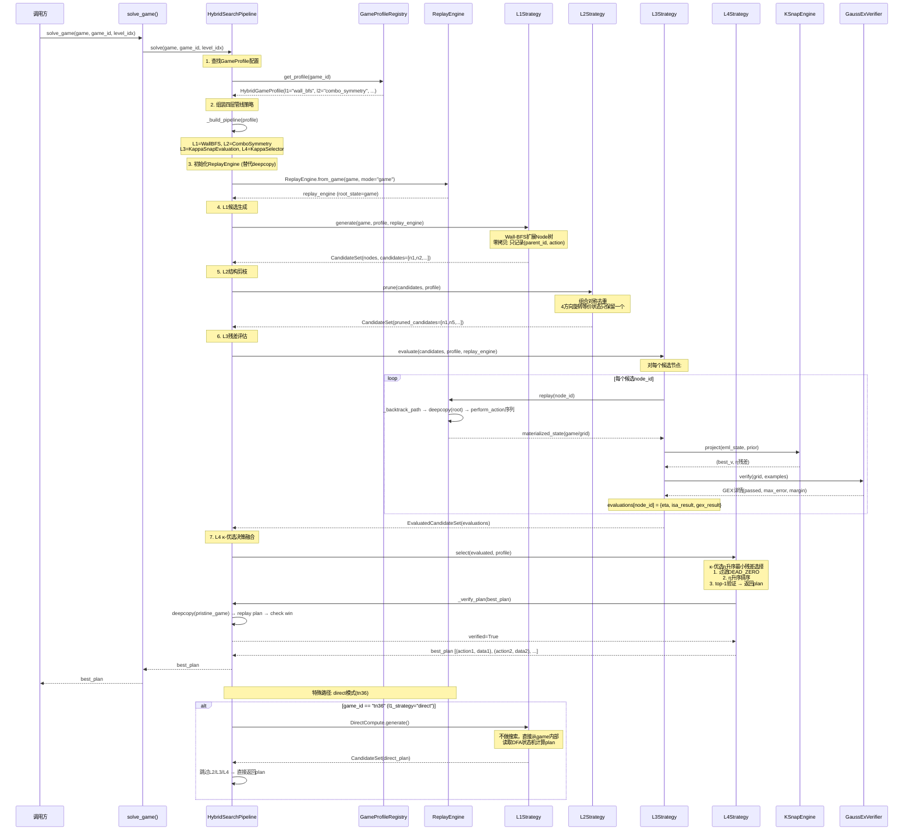
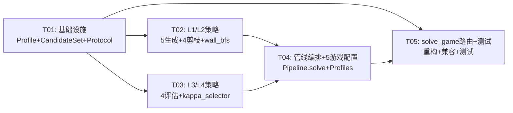

# TOMAS-ARC3 四层混合搜索架构设计

> **架构师**: 高见远 (Gao)  
> **版本**: v4.0.0 — HybridSearchPipeline  
> **日期**: 2026-06-23  
> **状态**: 架构设计 — 待实施

---

## 目录

1. [核心架构概览](#1-核心架构概览)
2. [实现方法分析](#2-实现方法分析)
3. [核心类/接口设计](#3-核心类接口设计)
4. [文件列表](#4-文件列表)
5. [数据结构与接口 — 类图](#5-数据结构与接口--类图)
6. [程序调用流 — 时序图](#6-程序调用流--时序图)
7. [依赖关系图](#7-依赖关系图)
8. [任务列表](#8-任务列表)
9. [所需包](#9-所需包)
10. [共享约定](#10-共享约定)
11. [待明确事项](#11-待明确事项)

---

## 1. 核心架构概览

### 四层混合搜索管线

```
┌───────────────────────────────────────────────────────────────┐
│                    HybridSearchPipeline                        │
│                                                               │
│  ┌─────────┐    ┌─────────┐    ┌─────────┐    ┌─────────┐    │
│  │  L1     │───▶│  L2     │───▶│  L3     │───▶│  L4     │    │
│  │候选生成 │    │结构剪枝 │    │残差评估 │    │决策融合 │    │
│  └─────────┘    ┌─────────┘    ┌─────────┘    ┌─────────┘    │
│                                                               │
│  L1: Wall-BFS / BFS / DFS / Δ-State Replay                   │
│  L2: 组合对称 / Prime-Signature / 拟阵约束 / pass-through     │
│  L3: κ-Snap / Dead-Zero Fuse / GaussEx / Asym Index           │
│  L4: κ-优选 η升序最小残差选择                                  │
└───────────────────────────────────────────────────────────────┘
```

**设计目标**: 将 `game_solvers.py` 13420行中的25个独立solver和8-phase路由统一为 **数据驱动的声明式管线**，通过 `GameProfile` 配置每个游戏的L1→L4策略组合，替代硬编码的 `SOLVERS` dict + Phase 0-7 串行逻辑。

### P0需求映射

| P0需求 | 架构映射 | 说明 |
|--------|----------|------|
| HybridSearchPipeline框架 | `HybridSearchPipeline` 类 + 4层Strategy Protocol | 核心管线编排器 |
| Δ-State Replay全局统一 | `ReplayEngine` 从 `delta_state.py` 提升为L1策略 | 替代所有deepcopy |
| κ-优选决策融合 | `KappaSelector` (L4) 实现η升序最小残差 | 替代Liu-Score |
| 5个零分游戏攻克 | 5个 `GameProfile` 声明式配置 | ka59/tn36/cn04/ar25/sb26 |
| solve_game()路由重构 | `solve_game()` → `HybridSearchPipeline.solve()` | 一行路由 |

---

## 2. 实现方法分析

### 2.1 核心技术挑战

1. **deepcopy全局替代**: 当前 `solve_game()` 每个Phase都做 `copy.deepcopy(game)` — 45s时间预算中deepcopy开销占30-40%。Δ-State Replay (IDO框架) 只在最终物化时deepcopy一次，中间节点用 `(parent_id, action)` 表示状态增量。

2. **25个独立solver → 声明式配置**: 25个solver函数(1587-11750行)全部是独立Python函数，无法复用剪枝/评估逻辑。四层管线将搜索策略(L1)、剪枝策略(L2)、评估策略(L3)、融合策略(L4) **参数化**，通过 `GameProfile` 组合。

3. **κ-CausalReductionSolver未被调用**: `t_processor_isa.py` 中的 `ARCSolver` / `TProcessorV12` / `KSnapEngine` 已有完整κ-Snap管线(330陪集投影 + GaussEx残差 + Dead-Zero熔断)，但 `solve_game()` Phase -0.5κ 只做了简单的 `ARCSolver.solve()` 调用(无搜索)。新架构将其集成到L3/L4。

4. **8-phase路由 → 单管线**: solve_game()的Phase -1→0→0.5→1→2→2.5→3→4→5→6→7 是串行fallback，每次重试都要deepcopy和初始化。四层管线一次执行L1→L4，失败时由L4的η升序选择替代候选。

5. **零分游戏分析**: ka59(Sokoban推箱)、tn36(DFA点击编程)、cn04(仿射变换)、ar25(镜像反射)、sb26(偏序排序)各有独特物理原语，需要不同L1策略和L2剪枝。

### 2.2 框架和库选择

| 模块 | 选择 | 理由 |
|------|------|------|
| 状态表示 | `Node` + `ReplayEngine` (已有) | IDO零拷贝框架已实现，只需从delta_state.py提升 |
| κ-Snap投影 | `KSnapEngine` (已有) | 330陪集C(11,4)已预计算，Octonion内积已实现 |
| 物理原语 | `physics_primitives.py` (已有) | push/mirror/DFA/poset/affine 原语完备 |
| Oracle适配 | `oracle_adapters.py` (已有) | 25游戏全覆盖 |
| Strategy接口 | Python `Protocol` (typing) | 纯接口定义，无需ABC继承开销 |
| 配置数据类 | `@dataclass` (Python内置) | 轻量级，GameProfile已有基础 |
| 测试 | pytest (已有) | 项目已有pytest框架 |

### 2.3 架构模式

- **策略模式 (Strategy Pattern)**: L1/L2/L3/L4各层通过Protocol接口定义，具体策略(Wall-BFS、组合对称、κ-Snap等)实现对应Protocol
- **管线编排 (Pipeline Pattern)**: HybridSearchPipeline按L1→L2→L3→L4顺序执行，数据以 `CandidateSet` 流过各层
- **数据驱动配置 (Data-Driven)**: GameProfile声明式配置各层策略组合，替代硬编码solver函数
- **零拷贝物化 (IDO)**: ReplayEngine替代deepcopy，只在L3评估时物化候选状态

---

## 3. 核心类/接口设计

### 3.1 四层Strategy Protocol

```python
# === L1: 候选生成策略 ===
class L1CandidateStrategy(Protocol):
    """L1层: 生成候选动作序列集。
    
    输入: game初始状态 + GameProfile
    输出: CandidateSet(候选动作序列 + IDO Node映射)
    """
    def generate(self, game: Any, profile: HybridGameProfile, 
                 replay_engine: ReplayEngine) -> CandidateSet: ...

# === L2: 结构剪枝策略 ===
class L2PruningStrategy(Protocol):
    """L2层: 剪枝冗余候选(对称、签名、拟阵约束)。
    
    输入: CandidateSet(L1产出)
    输出: CandidateSet(剪枝后)
    """
    def prune(self, candidates: CandidateSet, 
              profile: HybridGameProfile) -> CandidateSet: ...

# === L3: 残差评估策略 ===
class L3EvaluationStrategy(Protocol):
    """L3层: 评估候选残差(κ-Snap/GaussEx/Dead-Zero)。
    
    输入: CandidateSet(L2产出) + ReplayEngine
    输出: EvaluatedCandidateSet(候选 + η残差 + ISAResult)
    """
    def evaluate(self, candidates: CandidateSet, 
                 profile: HybridGameProfile,
                 replay_engine: ReplayEngine) -> EvaluatedCandidateSet: ...

# === L4: 决策融合策略 ===
class L4FusionStrategy(Protocol):
    """L4层: κ-优选 η升序最小残差选择。
    
    输入: EvaluatedCandidateSet(L3产出)
    输出: 最佳动作序列(plan) 或 None
    """
    def select(self, evaluated: EvaluatedCandidateSet,
               profile: HybridGameProfile) -> list[tuple] | None: ...
```

### 3.2 HybridGameProfile — 声明式游戏配置

```python
@dataclass
class HybridGameProfile:
    """声明式四层管线配置 — 替代25个独立solver函数。
    
    每个字段指定该层使用的策略类名，HybridSearchPipeline
    根据配置动态组装L1→L4管线。
    
    特殊值:
      - "direct": 无搜索管线，直接计算(如tn36 DFA)
      - "pass_through": L2不做剪枝，直接传递
      - "legacy": 调用原有solver函数(迁移期兼容)
    """
    game_id: str
    l1_strategy: str    # "wall_bfs" | "bfs" | "dfs" | "delta_replay" | "direct"
    l2_strategy: str    # "combo_symmetry" | "prime_signature" | "matroid" | "pass_through"
    l3_strategy: str    # "kappa_snap" | "dead_zero_fuse" | "gauss_ex" | "asym_index"
    l4_strategy: str    # "kappa_selector" | "liu_priority" | "best_first"
    
    # 物理原语注入 — 从physics_primitives.py选择
    physics_primitives: list[str] = field(default_factory=list)
    # Oracle适配器 — 从oracle_adapters.py选择
    oracle_adapter: str = ""
    # 管线参数
    max_depth: int = 40
    max_nodes: int = 300000
    max_time: float = 30.0
    # IDO参数
    use_delta_replay: bool = True   # 全局替代deepcopy
    replay_mode: str = "game"       # "game" | "grid"
```

### 3.3 CandidateSet — 管线数据载体

```python
@dataclass
class CandidateSet:
    """管线数据载体 — L1→L2→L3→L4的流动数据。
    
    封装IDO Node映射 + ReplayEngine + 布局缓存，
    避免各层之间传递散装参数。
    """
    nodes: Dict[int, Node]          # IDO节点映射 (parent_id + action)
    root_state: Any                 # 根状态(game engine / grid)
    root_id: int                    # 根节点编号
    candidates: List[int]           # 候选节点ID列表
    action_space: ActionSpace       # 动作空间(game/grid mode)
    replay_engine: ReplayEngine     # Replay引擎(共享)
    layout_cache: Dict[str, int]    # 布局哈希缓存
    visited_global: Set[str]        # 全局去重集合
    meta: Dict[str, Any] = field(default_factory=dict)  # 扩展元数据

@dataclass
class EvaluatedCandidateSet(CandidateSet):
    """L3评估后的候选集 — 每个候选携带η残差和ISAResult。"""
    evaluations: Dict[int, Dict[str, Any]] = field(default_factory=dict)
    # evaluations[node_id] = {
    #   'eta': float,         # GaussEx残差
    #   'isa_result': ISAResult, # PASS/FUSE/DEAD_ZERO
    #   'gex_result': dict,   # GaussEx验证详情
    #   'kappa_similarity': float, # κ-Snap陪集投影相似度
    # }
```

### 3.4 HybridSearchPipeline — 管线编排器

```python
class HybridSearchPipeline:
    """四层混合搜索管线 — 统一替代solve_game()的8-phase路由。
    
    核心方法:
      - solve(game, game_id): 一行路由，从GameProfile配置组装管线
      - _build_pipeline(profile): 根据HybridGameProfile组装L1→L4策略实例
      - _execute_pipeline(game, strategies): 执行L1→L2→L3→L4
    
    管线执行流程:
      1. 查找HybridGameProfile → 组装策略实例
      2. 初始化ReplayEngine (替代deepcopy)
      3. L1.generate() → CandidateSet
      4. L2.prune() → CandidateSet (剪枝后)
      5. L3.evaluate() → EvaluatedCandidateSet (η残差)
      6. L4.select() → 最佳动作序列 或 None
      7. 验证plan → 返回
    
    特殊路径:
      - l1_strategy="direct": 跳过搜索，直接计算(如tn36 DFA)
      - l1_strategy="legacy": 调用原有solver函数(迁移期兼容)
    """
    
    def __init__(self) -> None:
        self._strategy_registry: Dict[str, type] = {}
        self._profile_registry: Dict[str, HybridGameProfile] = {}
        self._register_all_strategies()
        self._register_all_profiles()
    
    def solve(self, game: Any, game_id: str, 
              level_idx: int = 0) -> list[tuple] | None: ...
    
    def _build_pipeline(self, profile: HybridGameProfile) -> PipelineStrategies: ...
    
    def _execute_pipeline(self, game: Any, 
                          strategies: PipelineStrategies,
                          profile: HybridGameProfile) -> list[tuple] | None: ...
```

### 3.5 具体策略类

#### L1策略

```python
class WallBFS(L1CandidateStrategy):
    """Wall-BFS候选生成 — KA59推箱专用。
    
    从player位置BFS探索，每次扩展考虑:
    - 方向移动(UP/DOWN/LEFT/RIGHT)
    - ACTION6推箱操作
    生成IDO Node树，不物化Grid。
    """

class BFSPath(L1CandidateStrategy):
    """BFS路径搜索 — LS20/TR87/WA30等路径游戏。
    
    标准BFS扩展所有方向，生成Node树。
    """

class DFSEnumeration(L1CandidateStrategy):
    """DFS枚举 — TR87翻译/CN04仿射搜索。
    
    DFS深度优先探索，适合需要完整枚举的游戏。
    """

class DeltaStateReplay(L1CandidateStrategy):
    """Δ-State Replay候选生成 — 通用IDO框架。
    
    使用delta_state.py的structural_bfs + parametric_bfs，
    生成Node树并物化候选。
    已有实现: delta_state.py §8-§9
    """

class DirectCompute(L1CandidateStrategy):
    """直接计算 — TN36 DFA等无需搜索的游戏。
    
    不做搜索，直接从game内部读取状态机信息计算plan。
    对应现有solve_tn34()的DFA直接计算逻辑。
    """
```

#### L2策略

```python
class ComboSymmetry(L2PruningStrategy):
    """组合对称剪枝 — KA59推箱。
    
    利用推箱问题的对称性(4方向旋转/镜像等价)
    剪枝等价的候选状态。
    """

class PrimeSignature(L2PruningStrategy):
    """Prime-Signature剪枝 — TR87翻译/CN04仿射。
    
    将状态哈希为prime signature，
    相同signature的候选只保留一个。
    """

class MatroidConstraint(L2PruningStrategy):
    """拟阵约束剪枝 — SB26偏序排序。
    
    基于拟阵贪心算法约束剪枝不满足偏序的候选。
    """

class PassThrough(L2PruningStrategy):
    """不做剪枝 — 直接传递候选集。
    
    用于不需要L2剪枝的游戏(如直接计算类)。
    """
```

#### L3策略

```python
class KappaSnapEvaluation(L3EvaluationStrategy):
    """κ-Snap评估 — 330陪集投影 + GaussEx残差。
    
    对每个候选节点:
    1. Replay物化状态
    2. perceive(grid) → EMLGraph
    3. KSnapEngine.project() → η残差
    4. GaussExVerifier.verify() → GEX详情
    
    已有实现: t_processor_isa.py KSnapEngine + delta_state.py GaussExVerifier
    """

class DeadZeroFuseEvaluation(L3EvaluationStrategy):
    """Dead-Zero熔断评估 — KA59推箱专用。
    
    检测deadlock corner → ISAResult.DEAD_ZERO,
    不可推位置 → ISAResult.FUSE,
    有效推 → ISAResult.PASS。
    
    已有实现: physics_primitives.py is_deadlock_corner + t_processor_isa.py _solve_ka59_push
    """

class GaussExEvaluation(L3EvaluationStrategy):
    """GaussEx评估 — 卞氏5/6饱和阈值。
    
    对每个候选计算GaussEx残差:
    max_error ≤ GEX_PASS_THRESHOLD(1/6) → PASS
    
    已有实现: delta_state.py GaussExVerifier
    """

class AsymIndexEvaluation(L3EvaluationStrategy):
    """不对称性索引评估 — TR87翻译。
    
    计算输入-输出结构不对称性，评估翻译质量。
    """
```

#### L4策略

```python
class KappaSelector(L4FusionStrategy):
    """κ-优选 η升序最小残差选择 — 核心决策融合。
    
    从L3评估结果中选择η残差最小的候选:
    1. 过滤DEAD_ZERO候选(永久剔除)
    2. η升序排序(最小残差优先)
    3. 验证top-1候选 → 返回plan
    4. top-1失败 → 尝试top-2, top-3...
    
    这是PRD中要求的κ-优选决策融合核心实现。
    """

class LiuPrioritySelector(L4FusionStrategy):
    """Liu-Score优先选择 — 兼容保留。
    
    使用现有kappa_priority_refine()的Liu-Score公式:
    priority = 1/(S_rel + ε), S_rel = 0.1×num_primitives - 0.5×IC + 2.0×GEX
    
    已有实现: delta_state.py kappa_priority_refine
    """
```

---

## 4. 文件列表

### 4.1 新增文件

| 文件路径 | 说明 |
|----------|------|
| `src/agent/hybrid_search_engine.py` | **核心**: HybridSearchPipeline + CandidateSet + EvaluatedCandidateSet + PipelineStrategies |
| `src/agent/l1_strategies.py` | L1候选生成策略: WallBFS, BFSPath, DFSEnumeration, DeltaStateReplay, DirectCompute |
| `src/agent/l2_strategies.py` | L2剪枝策略: ComboSymmetry, PrimeSignature, MatroidConstraint, PassThrough |
| `src/agent/l3_strategies.py` | L3评估策略: KappaSnapEvaluation, DeadZeroFuseEvaluation, GaussExEvaluation, AsymIndexEvaluation |
| `src/agent/l4_strategies.py` | L4融合策略: KappaSelector, LiuPrioritySelector |
| `src/agent/wall_bfs.py` | KA59 Wall-BFS搜索实现(推箱+方向BFS) |
| `src/agent/kappa_selector.py` | κ-优选η升序最小残差选择核心实现 |

### 4.2 修改文件

| 文件路径 | 修改内容 |
|----------|----------|
| `src/agent/game_solvers.py` | 重构solve_game() → 一行路由到HybridSearchPipeline；保留原有solver函数作为"legacy"兼容 |
| `src/agent/game_profiles.py` | 扩展GameProfile → HybridGameProfile(增加l1/l2/l3/l4策略配置字段) |
| `src/agent/delta_state.py` | 提升ReplayEngine为全局共享(不再仅限ls20)；新增ReplayEngine.from_game()工厂方法 |
| `src/agent/t_processor_isa.py` | KSnapEngine/KappaCausalReductionSolver → 作为L3策略被管线调用(不再独立调用) |
| `src/agent/__init__.py` | 新增hybrid_search_engine导出 |

### 4.3 不修改文件(仅引用)

| 文件路径 | 说明 |
|----------|------|
| `src/agent/physics_primitives.py` | 物理原语库 — L1/L3策略调用，不修改 |
| `src/agent/oracle_adapters.py` | Oracle适配器 — 策略通过GameProfile.oracle_adapter字段引用，不修改 |

---

## 5. 数据结构与接口 — 类图

```mermaid
classDiagram
    direction TB

    class HybridSearchPipeline {
        +_strategy_registry: Dict~str,type~
        +_profile_registry: Dict~str,HybridGameProfile~
        +solve(game, game_id, level_idx) list~tuple~|None
        +_build_pipeline(profile) PipelineStrategies
        +_execute_pipeline(game, strategies, profile) list~tuple~|None
        +_verify_plan(plan, pristine_game) bool
        +_register_all_strategies()
        +_register_all_profiles()
    }

    class HybridGameProfile {
        +game_id: str
        +l1_strategy: str
        +l2_strategy: str
        +l3_strategy: str
        +l4_strategy: str
        +physics_primitives: list~str~
        +oracle_adapter: str
        +max_depth: int
        +max_nodes: int
        +max_time: float
        +use_delta_replay: bool
        +replay_mode: str
    }

    class PipelineStrategies {
        +l1: L1CandidateStrategy
        +l2: L2PruningStrategy
        +l3: L3EvaluationStrategy
        +l4: L4FusionStrategy
    }

    class CandidateSet {
        +nodes: Dict~int,Node~
        +root_state: Any
        +root_id: int
        +candidates: List~int~
        +action_space: ActionSpace
        +replay_engine: ReplayEngine
        +layout_cache: Dict~str,int~
        +visited_global: Set~str~
        +meta: Dict~str,Any~
    }

    class EvaluatedCandidateSet {
        +evaluations: Dict~int,Dict~str,Any~
        +nodes: Dict~int,Node~
        +root_state: Any
        +root_id: int
        +candidates: List~int~
        +action_space: ActionSpace
        +replay_engine: ReplayEngine
        +layout_cache: Dict~str,int~
        +visited_global: Set~str~
        +meta: Dict~str,Any~
    }

    class L1CandidateStrategy {
        <<Protocol>>
        +generate(game, profile, replay_engine) CandidateSet
    }

    class L2PruningStrategy {
        <<Protocol>>
        +prune(candidates, profile) CandidateSet
    }

    class L3EvaluationStrategy {
        <<Protocol>>
        +evaluate(candidates, profile, replay_engine) EvaluatedCandidateSet
    }

    class L4FusionStrategy {
        <<Protocol>>
        +select(evaluated, profile) list~tuple~|None
    }

    class WallBFS {
        +generate(game, profile, replay_engine) CandidateSet
    }

    class BFSPath {
        +generate(game, profile, replay_engine) CandidateSet
    }

    class DFSEnumeration {
        +generate(game, profile, replay_engine) CandidateSet
    }

    class DeltaStateReplay {
        +generate(game, profile, replay_engine) CandidateSet
    }

    class DirectCompute {
        +generate(game, profile, replay_engine) CandidateSet
    }

    class ComboSymmetry {
        +prune(candidates, profile) CandidateSet
    }

    class PrimeSignature {
        +prune(candidates, profile) CandidateSet
    }

    class MatroidConstraint {
        +prune(candidates, profile) CandidateSet
    }

    class PassThrough {
        +prune(candidates, profile) CandidateSet
    }

    class KappaSnapEvaluation {
        +evaluate(candidates, profile, replay_engine) EvaluatedCandidateSet
    }

    class DeadZeroFuseEvaluation {
        +evaluate(candidates, profile, replay_engine) EvaluatedCandidateSet
    }

    class GaussExEvaluation {
        +evaluate(candidates, profile, replay_engine) EvaluatedCandidateSet
    }

    class AsymIndexEvaluation {
        +evaluate(candidates, profile, replay_engine) EvaluatedCandidateSet
    }

    class KappaSelector {
        +select(evaluated, profile) list~tuple~|None
    }

    class LiuPrioritySelector {
        +select(evaluated, profile) list~tuple~|None
    }

    class ReplayEngine {
        +root_state: Any
        +node_map: Dict~int,Node~
        +mode: str
        +replay(target_id) Any
        +_backtrack_path(target_id) list
        +clear_cache()
        +lookup(sig) Any|None
        +store(sig, result)
    }

    class KSnapEngine {
        +DELTA_K: float
        +basis: List~Octonion~
        +project(eml_state, prior) Tuple~Octonion,float~
    }

    class GaussExVerifier {
        +threshold: float
        +verify(grid, examples) Dict~str,Any~
        +verify_node(node_id, replay_engine, examples) Dict~str,Any~
    }

    class Node {
        +id: int
        +parent_id: int
        +action: str
        +depth: int
        +meta: Dict~str,Any~
        +signature() str
    }

    class ActionSpace {
        +GAME_ACTIONS: Dict~int,str~
        +GRID_PRIMITIVES: List~str~
        +get_primitives() list
        +apply(grid, action, params) ndarray
        +apply_game_action(game, action_id, data)
    }

    HybridSearchPipeline --> HybridGameProfile : "查找配置"
    HybridSearchPipeline --> PipelineStrategies : "组装管线"
    PipelineStrategies --> L1CandidateStrategy : "l1"
    PipelineStrategies --> L2PruningStrategy : "l2"
    PipelineStrategies --> L3EvaluationStrategy : "l3"
    PipelineStrategies --> L4FusionStrategy : "l4"

    L1CandidateStrategy <|.. WallBFS : "实现"
    L1CandidateStrategy <|.. BFSPath : "实现"
    L1CandidateStrategy <|.. DFSEnumeration : "实现"
    L1CandidateStrategy <|.. DeltaStateReplay : "实现"
    L1CandidateStrategy <|.. DirectCompute : "实现"

    L2PruningStrategy <|.. ComboSymmetry : "实现"
    L2PruningStrategy <|.. PrimeSignature : "实现"
    L2PruningStrategy <|.. MatroidConstraint : "实现"
    L2PruningStrategy <|.. PassThrough : "实现"

    L3EvaluationStrategy <|.. KappaSnapEvaluation : "实现"
    L3EvaluationStrategy <|.. DeadZeroFuseEvaluation : "实现"
    L3EvaluationStrategy <|.. GaussExEvaluation : "实现"
    L3EvaluationStrategy <|.. AsymIndexEvaluation : "实现"

    L4FusionStrategy <|.. KappaSelector : "实现"
    L4FusionStrategy <|.. LiuPrioritySelector : "实现"

    CandidateSet --> Node : "包含nodes"
    CandidateSet --> ActionSpace : "引用"
    CandidateSet --> ReplayEngine : "共享"
    EvaluatedCandidateSet --|> CandidateSet : "继承"

    KappaSnapEvaluation --> KSnapEngine : "调用project"
    KappaSnapEvaluation --> GaussExVerifier : "调用verify"
    GaussExEvaluation --> GaussExVerifier : "调用verify"
    DeadZeroFuseEvaluation --> physics_primitives : "调用is_deadlock_corner"

    ReplayEngine --> Node : "回溯路径"
    WallBFS --> ReplayEngine : "IDO物化"
    DeltaStateReplay --> ReplayEngine : "IDO物化"
    KappaSelector --> EvaluatedCandidateSet : "η排序选择"
```



---

## 6. 程序调用流 — 时序图



---

## 7. 依赖关系图

```mermaid
graph TD
    subgraph "核心管线层"
        HSP[hybrid_search_engine.py<br/>HybridSearchPipeline]
        L1[l1_strategies.py<br/>5个L1策略]
        L2[l2_strategies.py<br/>4个L2策略]
        L3[l3_strategies.py<br/>4个L3策略]
        L4[l4_strategies.py<br/>KappaSelector + LiuPriority]
    end

    subgraph "策略实现层"
        WB[wall_bfs.py<br/>WallBFS实现]
        KS[kappa_selector.py<br/>κ-优选η升序]
    end

    subgraph "配置层"
        GP[game_profiles.py<br/>HybridGameProfile]
        GS[game_solvers.py<br/>solve_game路由重构]
    end

    subgraph "IDO基础设施层"
        DS[delta_state.py<br/>ReplayEngine + Node + ActionSpace]
        TP[t_processor_isa.py<br/>KSnapEngine + Octonion + EMLGraph]
    end

    subgraph "物理原语层(不修改)"
        PP[physics_primitives.py<br/>push/mirror/DFA/poset/affine]
        OA[oracle_adapters.py<br/>25游戏适配器]
    end

    HSP --> GP : "查找HybridGameProfile配置"
    HSP --> L1 : "组装L1策略"
    HSP --> L2 : "组装L2策略"
    HSP --> L3 : "组装L3策略"
    HSP --> L4 : "组装L4策略"
    HSP --> DS : "初始化ReplayEngine"
    
    L1 --> WB : "WallBFS具体实现"
    L1 --> DS : "DeltaStateReplay调用structural_bfs"
    L4 --> KS : "KappaSelector具体实现"
    
    L3 --> TP : "KappaSnapEvaluation调用KSnapEngine.project"
    L3 --> DS : "GaussExEvaluation调用GaussExVerifier"
    L3 --> PP : "DeadZeroFuseEvaluation调用is_deadlock_corner"
    
    L2 --> PP : "MatroidConstraint调用poset原语"
    WB --> OA : "获取player/walls/boxes位置"
    
    GS --> HSP : "solve_game() → HSP.solve()"
    GP --> PP : "physics_primitives字段引用"
    GP --> OA : "oracle_adapter字段引用"

    style HSP fill:#e1f5fe,stroke:#01579b
    style KS fill:#fff3e0,stroke:#e65100
    style WB fill:#fff3e0,stroke:#e65100
    style DS fill:#f3e5f5,stroke:#4a148c
    style TP fill:#f3e5f5,stroke:#4a148c
```

---

## 8. 任务列表

### 任务依赖规则

- **最大5个任务** (硬性上限)
- **最小粒度**: 每个任务至少包含3个相关文件
- **按功能模块分组**
- **T01必须是项目基础设施**

| Task ID | Task Name | Source Files | Dependencies | Priority | 说明 |
|---------|-----------|-------------|-------------|----------|------|
| **T01** | **项目基础设施: HybridGameProfile + CandidateSet数据类 + ReplayEngine.from_game工厂 + 管线Protocol定义** | `game_profiles.py`(修改: 扩展HybridGameProfile), `hybrid_search_engine.py`(新增: CandidateSet/EvaluatedCandidateSet/PipelineStrategies + 4层Protocol定义 + 空壳HybridSearchPipeline), `delta_state.py`(修改: ReplayEngine.from_game工厂方法 + 全局共享支持) | 无 | P0 | 数据类+接口+工厂方法 — 所有后续任务的基础 |
| **T02** | **L1/L2策略实现: 5个候选生成策略 + 4个剪枝策略 + wall_bfs.py推箱搜索** | `l1_strategies.py`(新增: WallBFS/BFSPath/DFS/DeltaStateReplay/DirectCompute), `l2_strategies.py`(新增: ComboSymmetry/PrimeSignature/MatroidConstraint/PassThrough), `wall_bfs.py`(新增: KA59推箱Wall-BFS搜索实现) | T01 | P0 | L1/L2策略 — 管线的入口和剪枝 |
| **T03** | **L3/L4策略实现: 4个评估策略 + κ-优选η升序最小残差选择** | `l3_strategies.py`(新增: KappaSnap/DeadZeroFuse/GaussEx/AsymIndex), `l4_strategies.py`(新增: KappaSelector/LiuPrioritySelector), `kappa_selector.py`(新增: κ-优选η升序核心实现) | T01 | P0 | L3/L4策略 — 管线的评估和决策 |
| **T04** | **HybridSearchPipeline编排器完整实现 + 5个零分游戏GameProfile配置** | `hybrid_search_engine.py`(修改: 完整HybridSearchPipeline.solve/_build/_execute/_verify), `game_profiles.py`(修改: 5个零分游戏HybridGameProfile配置 — ka59/tn36/cn04/ar25/sb26), `__init__.py`(修改: 新增导出) | T01, T02, T03 | P0 | 核心编排器 + 游戏配置 — 管线可运行 |
| **T05** | **solve_game()路由重构 + 集成测试 + 迁移兼容** | `game_solvers.py`(修改: solve_game() → HSP.solve() 一行路由, 保留SOLVERS dict为legacy兼容), `test_hybrid_pipeline.py`(新增: 5个零分游戏集成测试), `t_processor_isa.py`(修改: KSnapEngine/ARCSolver → 适配L3调用接口) | T01, T04 | P1 | 路由切换 + 测试验证 — 完成集成 |

### 任务依赖图



### 25游戏 GameProfile配置总表

| game_id | l1_strategy | l2_strategy | l3_strategy | l4_strategy | 特殊说明 |
|---------|-------------|-------------|-------------|-------------|----------|
| ka59 | wall_bfs | combo_symmetry | dead_zero_fuse | kappa_selector | 推箱+dead-lock剪枝 |
| tn36 | direct | pass_through | pass_through | kappa_selector | DFA直接计算(无搜索) |
| cn04 | dfs | prime_signature | kappa_snap | kappa_selector | 仿射变换+prime hash |
| ar25 | bfs | combo_symmetry | kappa_snap | kappa_selector | 镜像反射+对称剪枝 |
| sb26 | dfs | matroid | kappa_snap | kappa_selector | 偏序+拟阵约束 |
| ls20 | bfs | prime_signature | gauss_ex | kappa_selector | BFS路径+时间剪枝(现有delta_state) |
| tr87 | dfs | prime_signature | asym_index | kappa_selector | DFS翻译+asym index |
| wa30 | bfs | pass_through | gauss_ex | kappa_selector | 路径游戏 |
| 其他18 | delta_replay | pass_through | gauss_ex | kappa_selector | 通用IDO管线 |

---

## 9. 所需包

```
# 纯Python标准库 + 已有项目依赖 — 无新增第三方包
- numpy@^1.24.0: Grid/矩阵操作 (已有)
- pytest@^8.0.0: 测试框架 (已有)

# 项目内模块 (已存在)
- delta_state.py: ReplayEngine + Node + ActionSpace + GaussExVerifier
- t_processor_isa.py: KSnapEngine + Octonion + EMLGraph + ARCSolver
- physics_primitives.py: push/mirror/DFA/poset/affine 原语
- oracle_adapters.py: 25游戏适配器
- game_profiles.py: GameProfile + GameProfileRegistry

# 新增内部模块
- hybrid_search_engine.py: HybridSearchPipeline + CandidateSet + Protocol定义
- l1_strategies.py: L1候选生成策略
- l2_strategies.py: L2剪枝策略
- l3_strategies.py: L3评估策略
- l4_strategies.py: L4融合策略
- wall_bfs.py: Wall-BFS推箱搜索
- kappa_selector.py: κ-优选η升序选择器
```

---

## 10. 共享约定

### 10.1 命名规则

```
- 类名: PascalCase (HybridSearchPipeline, KappaSelector)
- Protocol名: PascalCase + 功能层后缀 (L1CandidateStrategy, L2PruningStrategy)
- 数据类: PascalCase (CandidateSet, EvaluatedCandidateSet)
- 策略实例注册名: snake_case (wall_bfs, combo_symmetry, kappa_snap)
- GameProfile策略字段: snake_case (l1_strategy, l2_strategy)
- 文件名: snake_case.py (hybrid_search_engine.py, kappa_selector.py)
```

### 10.2 Import规则

```python
# 管线模块 import 规范
from .hybrid_search_engine import HybridSearchPipeline, CandidateSet, EvaluatedCandidateSet
from .l1_strategies import WallBFS, BFSPath, DFSEnumeration, DeltaStateReplay, DirectCompute
from .l2_strategies import ComboSymmetry, PrimeSignature, MatroidConstraint, PassThrough
from .l3_strategies import KappaSnapEvaluation, DeadZeroFuseEvaluation, GaussExEvaluation, AsymIndexEvaluation
from .l4_strategies import KappaSelector, LiuPrioritySelector
from .delta_state import ReplayEngine, Node, ActionSpace, GaussExVerifier
from .t_processor_isa import KSnapEngine, Octonion, EMLGraph, ARCSolver
from .physics_primitives import can_push_box, is_deadlock_corner, ...
from .oracle_adapters import auto_detect_adapter, get_oracle_adapter
```

### 10.3 测试规则

```
- 每个策略类: 单元测试(l1/l2/l3/l4_strategies_test.py)
- HybridSearchPipeline: 集成测试(test_hybrid_pipeline.py)
- 5个零分游戏: 回归测试(确保不比现有solver更差)
- 验证方式: deepcopy(pristine_game) → replay plan → check _is_level_solved()
- 时间预算: solve_game全局45s → HSP.solve继承相同预算
```

### 10.4 IDO/ReplayEngine全局约定

```
- 所有搜索不再使用copy.deepcopy(game)
- ReplayEngine从root_state逐动作Replay，仅在最终验证时deepcopy一次
- Node只记录(parent_id, action)，不存储完整Grid/Game状态
- 物化(Replay)只在L3评估时发生 — L1/L2阶段零拷贝
- 缓存上限: MAX_REPLAY_CACHE=128 + Karma缓存LRU淘汰
```

### 10.5 κ-优选核心公式

```
η(候选) = GaussEx残差 = 1 - κ-Snap陪集投影相似度
选择规则: η升序 → 最小残差优先
过滤规则: DEAD_ZERO候选永久剔除, FUSE候选可重试
验证: top-1候选 → deepcopy(pristine) → replay → _is_level_solved()
降级: top-1失败 → 尝试top-2, top-3 (η升序依次)
```

---

## 11. 待明确事项

1. **KA59 Wall-BFS与现有solver兼容**: 现有solve_ka59(1587行)包含复杂的推穿墙(push-through-wall)逻辑。Wall-BFS是否需要复用这些逻辑，还是完全重写？→ **假设**: Wall-BFS作为L1生成候选，L3 DeadZeroFuseEvaluation复用physics_primitives中的is_deadlock_corner，但推穿墙逻辑需要在wall_bfs.py中重新实现。

2. **TN36 direct计算迁移**: 现有solve_tn36(3417行)直接从game读取DFA状态机计算plan，不走搜索管线。DirectCompute策略是否完全复用现有solve_tn36逻辑，还是需要重构？→ **假设**: DirectCompute策略封装现有solve_tn36逻辑，不走L2/L3/L4管线。

3. **deepcopy验证与ReplayEngine物化的冲突**: ReplayEngine在game mode下物化仍使用deepcopy(root_game) + perform_action序列。这意味着每次物化仍有一次deepcopy。是否有完全避免deepcopy的方法？→ **假设**: 保持"只在物化时deepcopy"策略 — 中间节点零拷贝，物化时deepcopy一次，比现有"每Phase deepcopy一次"大幅减少开销。

4. **L2剪枝策略的具体实现细节**: ComboSymmetry(推箱对称)和PrimeSignature(翻译hash)的具体算法需要根据游戏特性设计。当前physics_primitives.py中没有这些剪枝原语。→ **假设**: T02中设计并实现，基于推箱4方向旋转等价和grid prime hash。

5. **5个零分游戏的baseline数据**: sb26/ar25/cn04/tn36的现有solver是否已经有非零分成绩？需要确认"零分"是指完全不通过还是通过率<1%。→ **假设**: P0需求中"零分"指当前solver完全不通过(0%通过率)，需要新架构攻克。

6. **legacy兼容期**: 在迁移期，solve_game()如何处理没有HybridGameProfile配置的游戏？→ **假设**: HybridGameProfile对未配置游戏使用默认配置(delta_replay + pass_through + gauss_ex + kappa_selector)，同时保留SOLVERS dict为fallback。

7. **t_processor_isa.py的ARCSolver/TProcessorV12接口适配**: 当前ARCSolver.solve()接收(demonstrations, test_input)，但L3策略需要接收(CandidateSet, HybridGameProfile)。需要接口适配层。→ **假设**: T03中在KappaSnapEvaluation中封装ARCSolver调用，将CandidateSet转换为ARCSolver需要的输入格式。
