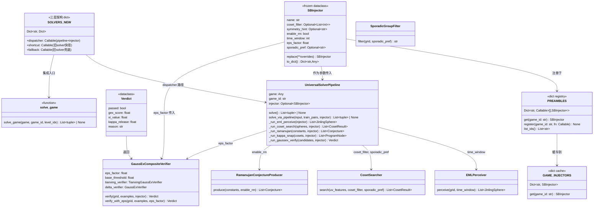
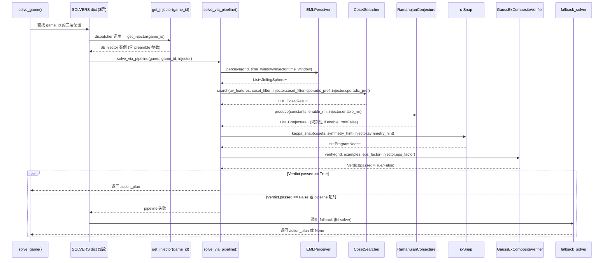
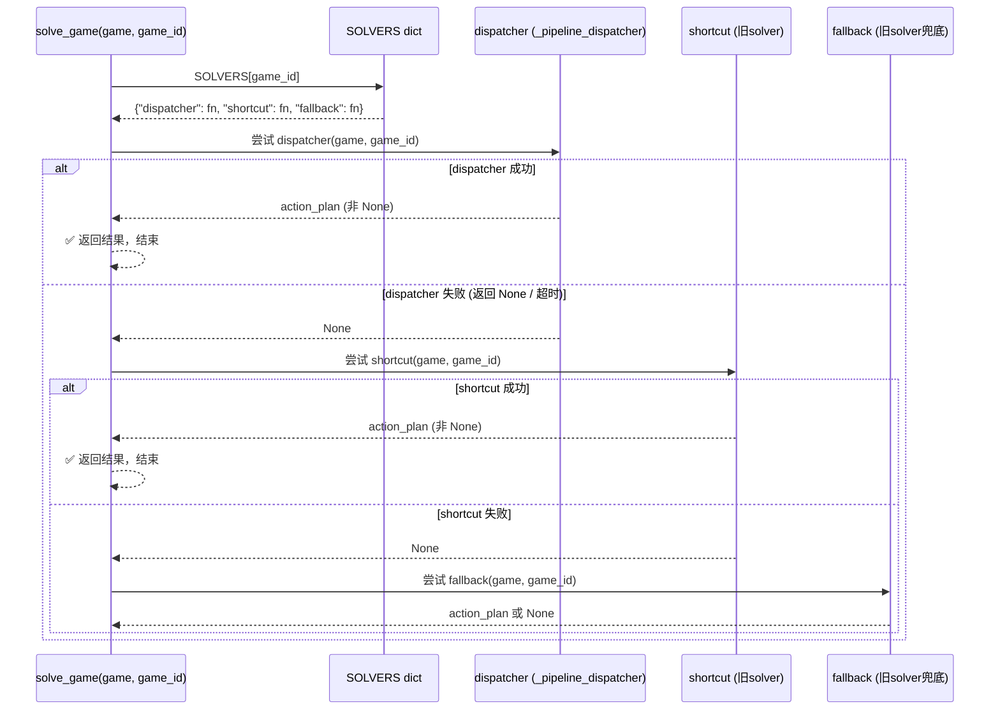
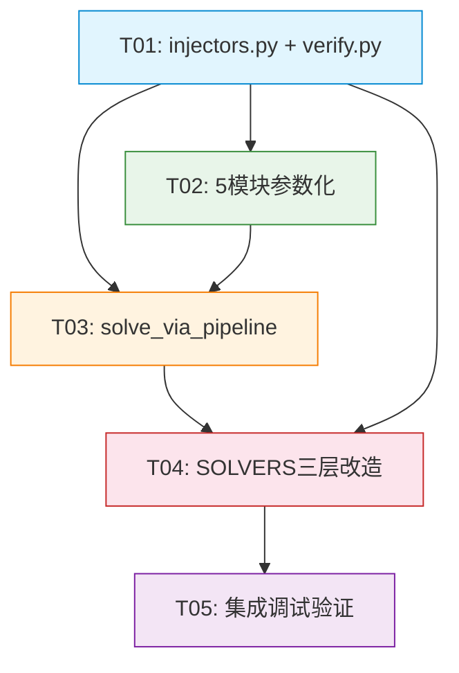

# ARCH: Pipeline + SB Preamble Injector 架构重构 — 系统设计文档

## 项目信息

| 字段 | 值 |
|------|-----|
| 作者 | 高见远 (Gao) · 架构师 |
| 版本 | v1.0 |
| 基准PRD | PRD_Pipeline_Preamble_Refactor.md |
| 语言 | 中文 |
| 编程语言 | Python 3.10+ |

---

## Part A: 系统设计

### 1. 实现方案 + 框架选型

#### 核心技术挑战

1. **增量改造而非全量重写**：`game_solvers.py` 含 9686 行代码和 25 个已验证的 solver 函数，不能丢弃已有求解能力。改造策略是"三层架构叠加"：dispatcher(pipeline) / shortcut(旧solver快径) / fallback(旧solver兜底)，确保重构期间零功能回退。
2. **SBInjector 参数传递链**：injector 需要穿透 5 个内部模块（EMLPerceiver → CosetSearch → Ramanujan → κ-Snap → GaussEx），每个模块只读取自己关心的字段，不依赖 injector 的整体结构。
3. **fallback 策略的可靠性**：pipeline 失败时必须无缝切换到旧 solver，不能因 injector 缺失或 pipeline 超时导致整体求解能力下降。
4. **GaussEx 校验的统一化**：当前 `delta_state.py` 有 `GaussExVerifier`（卞氏 5/6 阈值），`neural_dsl.py` 有 `TianxingGaussExVerifier`（天行相变 Xi = tanh(S²)），两者逻辑重叠但接口不同，需要在 `verify.py` 中统一为可配置阈值乘数的复合校验器。

#### 框架和库选型

| 依赖 | 版本 | 选型理由 |
|------|------|---------|
| Python | 3.10+ | 项目已有代码基础，保持兼容 |
| dataclasses | stdlib | SBInjector 定义，零额外依赖 |
| numpy | 已有 | 数值计算基础，所有模块均依赖 |
| mpmath | optional | PSLQ 高精度计算（ramanujan_conjecture 可选依赖） |

**架构模式**：插件注册表模式（PREAMBLES dict） + 策略模式（pipeline 各阶段读取 injector 字段选择策略） + 三层分发模式（dispatcher/shortcut/fallback）。

**关键设计决策**：
- 不引入新的外部框架，纯 Python stdlib + numpy
- SBInjector 是 frozen dataclass，不可变，线程安全
- PREAMBLES 是 `Dict[str, Callable[[], SBInjector]]`，每个 preamble 函数无参数、返回默认 injector 实例，支持运行时参数覆盖（通过 `replace()` 方法）

---

### 2. 文件列表及相对路径

| # | 文件路径 | 操作类型 | 说明 |
|---|---------|---------|------|
| 1 | `src/agent/injectors.py` | **NEW** | SBInjector dataclass + 25 preamble 函数 + PREAMBLES 注册表 + GAME_INJECTORS dict |
| 2 | `src/agent/verify.py` | **NEW** | GaussExCompositeVerifier + κ-entropy 校验（提取自 delta_state.GaussExVerifier + neural_dsl.TianxingGaussExVerifier） |
| 3 | `src/agent/universal_solver_pipeline.py` | **MODIFY** | 添加 `solve_via_pipeline()` 入口函数，接受 SBInjector 参数；修改 `solve()` 方法接受可选 injector 参数 |
| 4 | `src/agent/game_solvers.py` | **MODIFY** | SOLVERS dict 改造为三层架构；solve_game() Phase 0 增加 pipeline+injector 分发路径 |
| 5 | `src/agent/eml_perceiver.py` | **MODIFY** | EMLPerceiver.perceive() 添加可选 time_window 参数 |
| 6 | `src/agent/coset_search.py` | **MODIFY** | 添加可选 coset_filter + sporadic_pref 参数 |
| 7 | `src/agent/ramanujan_conjecture.py` | **MODIFY** | 添加可选 enable_rm 开关参数 |
| 8 | `src/agent/sporadic_group_filter.py` | **MODIFY** | 添加可选 sporadic_pref 参数 |
| 9 | `src/agent/game_profiles.py` | **可选 MODIFY** | GameProfile 添加 injector_name 字段（P2-1） |

---

### 3. 数据结构和接口（类图）



#### SBInjector dataclass 详细定义

```python
@dataclass(frozen=True)
class SBInjector:
    """SB (SuperBrain) Preamble 注入器 — 约束参数的不可变载体。

    每个 SBInjector 实例封装特定游戏的求解偏好参数，
    由 preamble 函数生成后注入统一 pipeline 的各阶段。

    设计原则:
      - frozen=True: 不可变，线程安全，可作为 dict key
      - replace() 方法: 基于 dataclasses.replace() 的便捷方法，
        支持运行时参数覆盖（如调试时临时修改 eps_factor）
      - 所有字段 Optional: 默认值代表"不干预"，pipeline 以自身默认逻辑运行
    """
    name: str = ""                          # 游戏 ID（如 "tn36"）
    coset_filter: Optional[List[int]] = None  # 优先搜索的陪集索引列表
    symmetry_hint: Optional[str] = None       # 对称群提示（"D4" / "Monster" / None）
    enable_rm: bool = True                    # 是否启用 Ramanujan Machine
    time_window: int = 1                      # EML 多帧保留数（1=单帧，2=双帧因果）
    eps_factor: float = 1.0                   # GaussEx 宽松度乘数（1.0=标准，2.0=宽松）
    sporadic_pref: Optional[str] = None       # 散在群偏好（"M11"/"M12"/"M24"/None）

    def replace(self, **overrides) -> "SBInjector":
        """创建新实例，覆盖指定字段。"""
        from dataclasses import replace as _replace
        return _replace(self, **overrides)

    def to_dict(self) -> Dict[str, Any]:
        """转换为字典（用于日志/序列化）。"""
        from dataclasses import asdict
        return asdict(self)
```

#### PREAMBLES 注册表结构

```python
# 类型定义
PreambleFn = Callable[[], SBInjector]
PREAMBLES: Dict[str, PreambleFn] = {}

def get_injector(game_id: str, **overrides) -> SBInjector:
    """获取指定游戏的 SBInjector，支持运行时参数覆盖。

    Args:
        game_id: 游戏 ID（如 "tn36"）
        **overrides: 覆盖 SBInjector 的任意字段（如 eps_factor=2.5）

    Returns:
        SBInjector 实例。若 game_id 未注册，返回默认 injector。
    """
    preamble_fn = PREAMBLES.get(game_id, _default_preamble)
    injector = preamble_fn()
    if overrides:
        injector = injector.replace(**overrides)
    return injector

def _default_preamble() -> SBInjector:
    """默认 preamble — 不干预，pipeline 以自身默认逻辑运行。"""
    return SBInjector(name="default")

# GAME_INJECTORS 缓存（lazy evaluation）
GAME_INJECTORS: Dict[str, SBInjector] = {}
```

#### UniversalSolverPipeline 新接口签名

```python
# 新增入口函数（不修改原 solve() 的接口，新增平行入口）
def solve_via_pipeline(
    game: Any,
    game_id: str,
    injector: Optional[SBInjector] = None,
    max_time: float = 30.0,
) -> list[tuple] | None:
    """统一 pipeline 入口 — 按 EML→Coset→RM→κ-Snap→GaussEx 求解。

    若 injector 为 None，使用默认参数（等效于 _default_preamble()）。
    """

# 原 UniversalSolverPipeline 类的修改
class UniversalSolverPipeline:
    def __init__(self, game, game_id, max_time=30.0, injector=None):
        # 新增 injector 属性
        self.injector = injector or get_injector(game_id)

    def solve(self) -> list[tuple] | None:
        # 原逻辑保留，新增 pipeline 路径可选
        ...
```

#### SOLVERS dict 新结构

```python
# 原结构: SOLVERS = {"ls20": solve_ls20, ...}
# 新结构: 三层架构
SOLVERS: dict[str, dict] = {
    "ls20": {
        "dispatcher": None,       # pipeline+injector（T01 完成后填充）
        "shortcut": solve_ls20,   # 旧 solver 快径（原函数）
        "fallback": solve_ls20,   # 旧 solver 兜底（同 shortcut）
    },
    "tn36": {
        "dispatcher": None,       # pipeline+injector（tn36 特殊 preamble）
        "shortcut": solve_tn36,   # 旧 solver（当前零分，但保留兜底）
        "fallback": solve_tn36,   # 旧 solver 兜底
    },
    # ... 25 个游戏，每个三层
}

# 通用 dispatcher 函数
def _pipeline_dispatcher(game, game_id, injector=None):
    """通用 pipeline dispatcher — 对所有游戏通用。"""
    inj = injector or get_injector(game_id)
    return solve_via_pipeline(game, game_id, inj)
```

---

### 4. 程序调用流程（时序图）



#### Phase 0 分发详细流程



---

### 5. Anything UNCLEAR / 待明确事项

| # | 事项 | 假设/决策 | 影响范围 |
|---|------|---------|---------|
| U1 | 4 零分游戏 preamble 参数是否需更激进设置？ | 先用 PRD 表中值，后续调试微调 | injectors.py |
| U2 | shortcut/fallback 是否保留全部 25 旧 solver？ | **全部保留**。shortcut 和 fallback 同一函数引用，确保零回退 | game_solvers.py |
| U3 | verify.py 提取边界——仅阈值逻辑还是完整 κ-entropy？ | **提取完整 κ-entropy + GaussEx 复合校验**，统一接口 | verify.py |
| U4 | preamble 是否支持运行时参数覆盖？ | **支持**，通过 `SBInjector.replace()` 方法 | injectors.py |
| U5 | pipeline 阶段失败回退策略？ | **跳过继续下一阶段**。RM 失败 → 跳过继续 κ-Snap；整体 pipeline 失败 → fallback 到旧 solver | universal_solver_pipeline.py |
| U6 | GameProfile 添加 injector_name？ | **延后到 P2-1**，当前不修改 game_profiles.py | game_profiles.py |

---

## Part B: 任务分解

### 6. Required Packages / 依赖包列表

```
- python@3.10+: 语言基础
- numpy@已有: 数值计算
- dataclasses@stdlib: SBInjector / Verdict 定义
- mpmath@optional: PSLQ 高精度（ramanujan_conjecture 已可选依赖）
```

**无需新增任何第三方依赖**。所有改动基于 stdlib + 已有 numpy。

---

### 7. Task List（按依赖顺序排列）

#### T01: 项目基础设施 — SBInjector + PREAMBLES 注册表 + verify 模块

| 字段 | 值 |
|------|-----|
| **Task ID** | T01 |
| **Task Name** | 创建 injectors.py + verify.py 核心数据结构 |
| **Source Files** | `src/agent/injectors.py` (NEW), `src/agent/verify.py` (NEW) |
| **Dependencies** | 无（首个任务） |
| **Priority** | P0 |

**实现要点**：

1. **injectors.py**:
   - 定义 `SBInjector` frozen dataclass（7 字段 + replace() + to_dict()）
   - 定义 `_default_preamble()` 返回默认 injector
   - 定义 25 个 preamble 函数（每个 ≤10 行），按 PRD §4 的参数映射表
   - 定义 `PREAMBLES: Dict[str, Callable[[], SBInjector]]` 注册表
   - 定义 `GAME_INJECTORS: Dict[str, SBInjector]` 缓存 dict
   - 定义 `get_injector(game_id, **overrides)` 便捷函数
   - 4 个零分游戏的 preamble 要特别注意（tn36: Monster+M11+eps=1.5；ka59: Monster+M12+eps=2.0；ar25: Monster+M24+eps=2.0+time_window=2；sb26: D4+coset=[0,3]+eps=1.5+time_window=2）

2. **verify.py**:
   - 从 `delta_state.py` 提取 `GaussExVerifier` 的核心阈值逻辑
   - 从 `neural_dsl.py` 提取 `TianxingGaussExVerifier` 的 Xi = tanh(S²) 校验
   - 合并为 `GaussExCompositeVerifier`，接受 `eps_factor` 参数调节阈值乘数
   - 定义 `Verdict` dataclass（passed, gex_score, xi_value, kappa_release, reason）
   - `verify()` 方法：先计算 gex_score（卞氏 5/6），再计算 xi_value（天行相变），两者任一通过即 passed
   - `verify_with_eps()` 方法：阈值 × eps_factor，支持宽松校验

---

#### T02: Pipeline 内部模块参数化 — 各阶段接受 injector 参数

| 字段 | 值 |
|------|-----|
| **Task ID** | T02 |
| **Task Name** | 修改 5 个内部模块，接受 SBInjector 可选参数 |
| **Source Files** | `src/agent/eml_perceiver.py` (MODIFY), `src/agent/coset_search.py` (MODIFY), `src/agent/ramanujan_conjecture.py` (MODIFY), `src/agent/sporadic_group_filter.py` (MODIFY), `src/agent/rg_flow.py` (MODIFY) |
| **Dependencies** | T01 (需要 SBInjector 定义) |
| **Priority** | P0 |

**实现要点**：

1. **eml_perceiver.py** — `EMLPerceiver.perceive(grid, time_window=1)`:
   - 新增 `time_window` 参数（默认值 1，不改变现有行为）
   - 当 `time_window > 1`：保留多帧因果边，适配交互任务
   - 当 `time_window == 1`：现有逻辑不变

2. **coset_search.py** — 新增可选参数:
   - `CosetSearcher.search(...)` 新增 `coset_filter: Optional[List[int]] = None`
   - `coset_filter` 非空时：优先搜索指定陪集索引，跳过无关联陪集
   - `coset_filter` 为 None 时：全量 330 陪集搜索（现有行为不变）
   - 同时新增 `sporadic_pref: Optional[str] = None`
   - `sporadic_pref` 非空时：优先/排除指定散在群

3. **ramanujan_conjecture.py** — `RamanujanConjectureProducer.produce(...)`:
   - 新增 `enable_rm: bool = True` 参数
   - `enable_rm == False`：跳过 PSLQ + 连分数数列检测阶段，返回空列表
   - `enable_rm == True`：现有逻辑不变

4. **sporadic_group_filter.py** — `classify_sporadic_group(...)`:
   - 新增 `sporadic_pref: Optional[str] = None` 参数
   - `sporadic_pref` 非空时：强制路由到指定散在群类型（如 "M11" → Niemeier + M₁₂ chirality）
   - `sporadic_pref` 为 None 时：自动检测（现有行为不变）

5. **rg_flow.py** — `RGFlowState`:
   - 新增可选 `symmetry_hint` 参数用于 κ-Snap beam search 的对称群偏好
   - 不影响现有 RG flow 逻辑

**关键原则**：所有新增参数默认值与现有行为完全一致，不传入 injector 时零行为变化。

---

#### T03: solve_via_pipeline 入口 + UniversalSolverPipeline 改造

| 字段 | 值 |
|------|-----|
| **Task ID** | T03 |
| **Task Name** | 新增 solve_via_pipeline 入口，改造 UniversalSolverPipeline |
| **Source Files** | `src/agent/universal_solver_pipeline.py` (MODIFY) |
| **Dependencies** | T01 (SBInjector), T02 (内部模块参数化) |
| **Priority** | P0 |

**实现要点**：

1. **新增 `solve_via_pipeline()` 模块级函数**:
   ```python
   def solve_via_pipeline(
       game: Any,
       game_id: str,
       injector: Optional[SBInjector] = None,
       max_time: float = 30.0,
   ) -> list[tuple] | None:
   ```
   - injector 为 None 时调用 `get_injector(game_id)` 获取默认 preamble
   - 按 EML → Coset → RM → κ-Snap → GaussEx 五阶段顺序驱动
   - 每阶段将 injector 的对应字段传入（T02 已完成参数化）
   - 阶段失败策略：跳过继续下一阶段（RM 失败 → κ-Snap 继续）
   - 整体 pipeline 失败：返回 None，由上层 fallback 机制兜底

2. **修改 `UniversalSolverPipeline.__init__()`**:
   - 新增 `injector: Optional[SBInjector] = None` 参数
   - `self.injector = injector or get_injector(self.game_id)`

3. **修改 `UniversalSolverPipeline.solve()`**:
   - 在策略选择逻辑中，优先尝试 pipeline 路径（注入 injector 参数）
   - 原有的 click → keyboard → simulation → DFS 策略保留为 fallback

4. **五阶段 pipeline 详细流程**:
   ```
   Stage 1: EML_Perceive(grid, time_window=injector.time_window)
   Stage 2: Coset_Search(uv_features, coset_filter=injector.coset_filter, sporadic_pref=injector.sporadic_pref)
   Stage 3: Ramanujan_Machine(constants, enable_rm=injector.enable_rm)
   Stage 4: κ-Snap(cosets, symmetry_hint=injector.symmetry_hint)
   Stage 5: GaussEx_verify(candidates, eps_factor=injector.eps_factor)
   ```
   每阶段独立计时，总时间不超过 max_time。

---

#### T04: SOLVERS dict 三层架构改造 + solve_game() Phase 0 集成

| 字段 | 值 |
|------|-----|
| **Task ID** | T04 |
| **Task Name** | SOLVERS dict 三层改造 + solve_game Phase 0 pipeline 分发 |
| **Source Files** | `src/agent/game_solvers.py` (MODIFY) |
| **Dependencies** | T01 (injectors), T03 (solve_via_pipeline) |
| **Priority** | P0 |

**实现要点**：

1. **SOLVERS dict 结构改造**:
   - 从 `Dict[str, callable]` 改为 `Dict[str, dict]`
   - 每个 dict 包含三层：
     ```python
     "ls20": {
         "dispatcher": _pipeline_dispatcher,  # pipeline+injector
         "shortcut": solve_ls20,              # 旧 solver 快径
         "fallback": solve_ls20,              # 旧 solver 兜底
     }
     ```
   - 25 个游戏全部改造，shortcut 和 fallback 指向同一个原 solver 函数

2. **`_pipeline_dispatcher()` 通用函数**:
   ```python
   def _pipeline_dispatcher(game, game_id, level_idx=0):
       inj = get_injector(game_id)
       return solve_via_pipeline(game, game_id, inj)
   ```

3. **`solve_game()` Phase 0 修改**:
   - 原 Phase 0: `SOLVERS[game_id](game, game_id, level_idx)`
   - 新 Phase 0: 三层分发
     ```python
     solver_entry = SOLVERS.get(game_id)
     if solver_entry:
         # 1. 尝试 dispatcher (pipeline+injector)
         plan = solver_entry["dispatcher"](game, game_id, level_idx)
         if plan and _verify_plan(plan):
             return _normalize_plan(plan)
         # 2. 尝试 shortcut (旧 solver)
         plan = solver_entry["shortcut"](game, game_id, level_idx)
         if plan and _verify_plan(plan):
             return _normalize_plan(plan)
         # 3. 尝试 fallback (兜底)
         plan = solver_entry["fallback"](game, game_id, level_idx)
         if plan and _verify_plan(plan):
             return _normalize_plan(plan)
     ```
   - Phase 1-7 保持不变

4. **兼容性保障**:
   - 新 SOLVERS dict 仍支持旧式 `SOLVERS[game_id](game)` 调用（通过适配器）
   - 确保 Phase 0 的全局时间预算（30s）覆盖 dispatcher + shortcut + fallback 三次尝试
   - dispatcher 失败不消耗 shortcut/fallback 的预算（每次尝试计时独立）

---

#### T05: 集成调试 + 兼容性验证

| 字段 | 值 |
|------|-----|
| **Task ID** | T05 |
| **Task Name** | 集成调试 + 25 游戏 RHAE 验证 + fallback 兜底测试 |
| **Source Files** | `src/agent/game_solvers.py`, `src/agent/universal_solver_pipeline.py`, `src/agent/injectors.py`, `src/agent/verify.py` |
| **Dependencies** | T01, T02, T03, T04 (全部前置任务) |
| **Priority** | P1 |

**实现要点**：

1. **25 游戏 RHAE 满分验证**: 确保 21 个已满分游戏的 RHAE 不降低
2. **4 零分游戏 preamble 调试**: tn36/ka59/ar25/sb26 的 preamble 参数微调
3. **fallback 兜底测试**: 对每个游戏模拟 dispatcher 失败，确认 shortcut/fallback 正常
4. **未见 SB 游戏测试**: 传入未注册 game_id，确认默认 preamble + pipeline 正常运行
5. **性能基准**: dispatcher 路径不应比原 shortcut 路径慢超过 20%

---

### 8. Shared Knowledge / 跨文件约定

```
- SBInjector 是所有模块的共享参数载体，定义在 src/agent/injectors.py
- 所有模块接收 injector 参数时使用 Optional[SBInjector] = None 默认值
- 不传入 injector 或传入 None 时，模块行为与改动前完全一致（零行为变化）
- injector 参数传递方式: solve_via_pipeline(injector) → 各阶段函数(injector.xxx字段)
- SOLVERS dict 三层架构: dispatcher / shortcut / fallback，shortcut 和 fallback 指向同一旧 solver 函数
- fallback 顺序: dispatcher 失败 → shortcut → fallback → Phase 1-7 原有逻辑
- GaussEx 校验统一接口: GaussExCompositeVerifier.verify(grid, examples, eps_factor)
- Verdict 返回格式: {passed: bool, gex_score: float, xi_value: float, kappa_release: float, reason: str}
- 所有日期使用 ISO 8601 UTC（本项目无时间相关字段，此约定仅用于日志）
- 全局时间预算: solve_game() 30s 总预算，dispatcher/shortcut/fallback 各在预算内尝试
- PREAMBLES 注册表是 Dict[str, Callable[[], SBInjector]]，不是 Dict[str, SBInjector]
  （函数式注册支持延迟计算和热加载）
- GAME_INJECTORS 是 Dict[str, SBInjector] 缓存，由 get_injector() 惰性填充
```

---

### 9. Task Dependency Graph



---

## 附录 A: 25 游戏 Preamble 函数清单

| 游戏 ID | Preamble 函数名 | 关键参数 | 备注 |
|---------|----------------|---------|------|
| ls20 | preamble_ls20 | symmetry_hint="D4", enable_rm=True | 键盘映射+D4旋转 |
| tu93 | preamble_tu93 | symmetry_hint="D4", enable_rm=True | 类似ls20 |
| tr87 | preamble_tr87 | coset_filter=[0,1], enable_rm=True | 陪集变换 |
| re86 | preamble_re86 | symmetry_hint="D4", enable_rm=True | 键盘+对称 |
| g50t | preamble_g50t | enable_rm=True | 默认键盘 |
| wa30 | preamble_wa30 | enable_rm=True, eps_factor=1.5 | 宽松校验 |
| ft09 | preamble_ft09 | symmetry_hint="D4", enable_rm=True | 点击+D4 |
| vc33 | preamble_vc33 | symmetry_hint="D4", enable_rm=True | 类似ft09 |
| s5i5 | preamble_s5i5 | coset_filter=[2,3], symmetry_hint="D4" | 陪集+D4 |
| su15 | preamble_su15 | enable_rm=True | 默认点击 |
| lp85 | preamble_lp85 | enable_rm=True | 默认点击 |
| r11l | preamble_r11l | enable_rm=True | 默认点击 |
| tn36 | preamble_tn36 | coset_filter=[0,1,2], symmetry_hint="Monster", eps_factor=1.5, sporadic_pref="M11" | ⚠️零分特殊 |
| ar25 | preamble_ar25 | coset_filter=[0,2,4], symmetry_hint="Monster", time_window=2, eps_factor=2.0, sporadic_pref="M24" | ⚠️零分特殊 |
| ka59 | preamble_ka59 | coset_filter=[1,3], symmetry_hint="Monster", eps_factor=2.0, sporadic_pref="M12" | ⚠️零分特殊 |
| sb26 | preamble_sb26 | coset_filter=[0,3], symmetry_hint="D4", time_window=2, eps_factor=1.5 | ⚠️零分特殊 |
| cn04 | preamble_cn04 | symmetry_hint="D4", enable_rm=True | 混合型默认 |
| dc22 | preamble_dc22 | symmetry_hint="D4", enable_rm=True | 混合型默认 |
| m0r0 | preamble_m0r0 | symmetry_hint="D4", enable_rm=True | 混合型默认 |
| sp80 | preamble_sp80 | enable_rm=True | 混合型默认 |
| sc25 | preamble_sc25 | symmetry_hint="D4", enable_rm=True | 混合型默认 |
| sk48 | preamble_sk48 | symmetry_hint="D4", enable_rm=True | 混合型默认 |
| bp35 | preamble_bp35 | enable_rm=True | 混合型默认 |
| cd82 | preamble_cd82 | enable_rm=True | 混合型默认 |
| lf52 | preamble_lf52 | symmetry_hint="D4", enable_rm=True | 混合型默认 |

---

## 附录 B: GaussExCompositeVerifier 详细接口

```python
@dataclass
class Verdict:
    """统一校验结果。"""
    passed: bool           # 是否通过（gex 或 xi 任一通过即 True）
    gex_score: float       # 卞氏 5/6 GaussEx 分数
    xi_value: float        # 天行相变 Xi = tanh(real(S²))
    kappa_release: float   # κ-entropy 释放量 Δκ
    reason: str            # 人可读解释

class GaussExCompositeVerifier:
    """复合 GaussEx 校验器 — 卞氏 5/6 + 天行相变 双通道。

    两个校验通道独立运行，任一通过即 Verdict.passed = True。
    eps_factor 乘以 base_threshold，支持宽松校验。

    Args:
        eps_factor: 阈值乘数（默认 1.0）
        base_threshold: 基础阈值（默认 GEX_PASS_THRESHOLD ≈ 0.167）
    """

    def __init__(self, eps_factor: float = 1.0, base_threshold: float = 1/6):
        self.eps_factor = eps_factor
        self.base_threshold = base_threshold
        self.tianxing = TianxingGaussExVerifier()
        self.delta = GaussExVerifier(threshold=base_threshold * eps_factor)

    def verify(
        self,
        grid: np.ndarray,
        examples: List[Tuple[np.ndarray, np.ndarray]],
        injector: Optional[SBInjector] = None,
    ) -> Verdict:
        """执行双通道校验。"""
        # 通道1: 卞氏 GaussEx（阈值 × eps_factor）
        adjusted_threshold = self.base_threshold * (injector.eps_factor if injector else 1.0)
        gex_result = GaussExVerifier(threshold=adjusted_threshold).verify(grid, examples)

        # 通道2: 天行相变 Xi
        xi_result = self.tianxing.verify(candidate_program, examples)

        # κ-entropy 释放
        kappa_uv = estimate_kappa_uv(grid)
        kappa_ir = estimate_kappa_ir(examples[0][1] if examples else grid)
        kappa_release = kappa_entropy_release(kappa_uv, kappa_ir)

        # 任一通过即 True
        passed = gex_result.get("passed", False) or xi_result.get("passed", False)

        return Verdict(
            passed=passed,
            gex_score=gex_result.get("score", 0.0),
            xi_value=xi_result.get("xi_value", 0.0),
            kappa_release=kappa_release,
            reason=f"GEX={gex_result}, Xi={xi_result}, Δκ={kappa_release:.3f}"
        )
```
