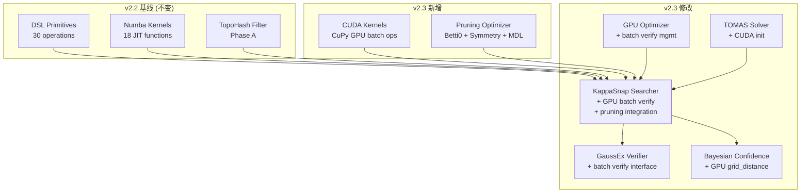
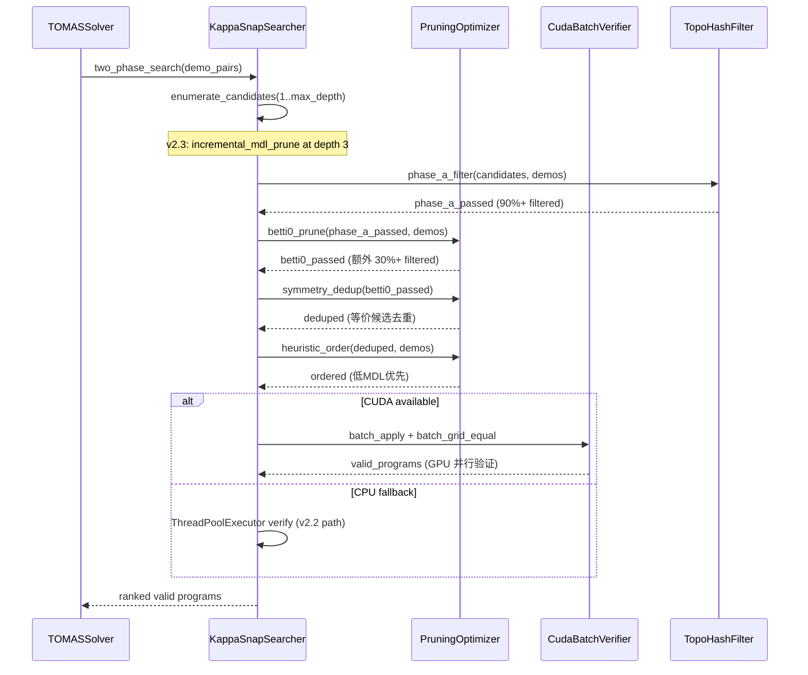

# TOMAS v2.3 架构设计 — CUDA 加速 + 高级剪枝

> **架构师**: 高见远 (Gao Jianyuan)  
> **基于**: PRD-CUDA-Pruning-v2.3.md  
> **日期**: 2026-06-22

---

## 一、系统架构图



## 二、技术栈选型

| 层 | 技术 | 选型理由 |
|---|------|---------|
| GPU 计算 | CuPy | NumPy 兼容 API，零学习成本，Kaggle T4 原生支持 |
| GPU 内存管理 | PyTorch (已有) | 复用现有 GPUOptimizer，VRAM 探测/批大小自适应 |
| 剪枝策略 | 纯 Python + NumPy | 剪枝逻辑轻量，无需 GPU |
| 降级机制 | HAS_CUDA 标志 | 与 HAS_NUMBA 模式一致，import 失败时优雅降级 |

## 三、文件列表

### 新建文件

| 文件 | 说明 |
|------|------|
| `src/core/cuda_kernels.py` | CuPy GPU 内核：批量 grid_equal, grid_distance, batch apply |
| `src/solver/pruning_optimizer.py` | 高级剪枝：Betti₀, 对称去重, 增量 MDL, 启发式排序 |

### 修改文件

| 文件 | 修改内容 |
|------|---------|
| `src/solver/kappa_snap_searcher.py` | Phase B GPU 批量验证路径 + 剪枝集成 |
| `src/solver/gaussex_verifier.py` | 新增 `verify_program_batch` 批量接口 |
| `src/solver/bayesian_confidence.py` | 似然计算使用 GPU grid_distance |
| `src/solver/tomas_solver.py` | 初始化 CUDA 配置，传递给搜索器 |
| `src/utils/gpu_optimizer.py` | 新增 `batch_verify_candidates` 方法 |
| `config/default.yaml` | 新增 `cuda` + `pruning` 配置段 |
| `requirements.txt` | 添加 cupy 可选依赖 |

## 四、数据结构和接口

### 4.1 CUDA Kernels (`src/core/cuda_kernels.py`)

```python
# 模块级标志
HAS_CUDA: bool  # cupy + CUDA GPU 可用

class CudaBatchVerifier:
    """GPU 批量验证器：在 GPU 上并行验证 N 个候选 × M 个 demo pair。"""

    def __init__(self, batch_size: int = 256) -> None: ...

    def batch_grid_equal(
        self,
        predictions: np.ndarray,  # (N, H, W) int8 — N 个预测网格
        expected: np.ndarray,     # (M, H, W) int8 — M 个期望网格
    ) -> np.ndarray:
        """批量比较: 返回 (N, M) bool 矩阵，[i,j]=True 表示 predictions[i]==expected[j]。
        GPU 上将 N×M×H×W 的比较并行化。"""
        ...

    def batch_grid_distance(
        self,
        predictions: np.ndarray,  # (N, H, W)
        expected: np.ndarray,     # (M, H, W)
    ) -> np.ndarray:
        """批量距离: 返回 (N, M) int32 矩阵，像素差异计数。"""
        ...

    def batch_apply_mirror(
        self, grids: np.ndarray   # (N, H, W)
    ) -> np.ndarray:
        """批量水平镜像: GPU 上 fliplr 所有网格。"""
        ...

    def batch_apply_rotate(
        self, grids: np.ndarray,  # (N, H, W)
        k: int = 1                # 90° × k
    ) -> np.ndarray:
        """批量旋转。"""
        ...
```

### 4.2 Pruning Optimizer (`src/solver/pruning_optimizer.py`)

```python
class PruningOptimizer:
    """高级搜索剪枝优化器。

    集成多种剪枝策略，在候选枚举和 Phase A/B 之间减少无效候选。
    """

    def __init__(self, config: dict) -> None: ...

    def betti0_prune(
        self,
        candidates: list[ProgramNode],
        demo_pairs: list[dict],
    ) -> list[ProgramNode]:
        """Betti₀ 不变量剪枝：预计算 demo output 的 Betti₀，
        剪除候选 apply 后 Betti₀ 不匹配的程序。

        原理：如果 P(I_i) 的 Betti₀ != Betti₀(O_i)，
        则 P 不可能是正确程序（拓扑必要条件）。
        """
        ...

    def symmetry_dedup(
        self,
        candidates: list[ProgramNode],
    ) -> list[ProgramNode]:
        """对称等价去重：如果两个候选程序在对称变换下等价，
        只保留一个。

        使用 4 种基本对称：identity, hflip, vflip, rot180。
        对每个候选计算其对称规范化签名，去重。
        """
        ...

    def incremental_mdl_prune(
        self,
        depth: int,
        partial_mdl: int,
        mdl_threshold: int,
    ) -> bool:
        """增量 MDL 剪枝：在枚举 depth 3 时，
        如果前两个 primitive 的 MDL 已超阈值，
        跳过第三个的枚举。

        Returns: True 表示应该跳过（prune）。
        """
        ...

    def heuristic_order(
        self,
        candidates: list[ProgramNode],
        demo_pairs: list[dict],
    ) -> list[ProgramNode]:
        """启发式排序：低 MDL + 高拓扑匹配度优先。

        排序键: primary = MDL (ascending)
                secondary = topo_match_score (descending)
        """
        ...

    def compute_betti0_fast(self, grid: np.ndarray) -> int:
        """快速 Betti₀ 计算：scipy.ndimage.label 统计连通分量。
        避免完整 Octonion 编码开销。"""
        ...
```

### 4.3 KappaSnapSearcher 修改

```python
class KappaSnapSearcher:
    # 新增属性
    cuda_verifier: CudaBatchVerifier | None  # GPU 验证器
    pruning: PruningOptimizer | None          # 剪枝优化器
    use_cuda: bool                             # 是否启用 CUDA

    def two_phase_search(self, demo_pairs):
        # v2.3 流程:
        # 1. 枚举候选 (带增量 MDL 剪枝)
        # 2. Phase A: 拓扑哈希过滤 (不变)
        # 3. v2.3 NEW: Betti₀ 剪枝
        # 4. v2.3 NEW: 对称去重
        # 5. v2.3 NEW: 启发式排序
        # 6. Phase B: GPU 批量验证 (CUDA) 或 CPU 并行 (fallback)
        ...

    def _phase_b_gpu_verify(self, candidates, demo_pairs) -> list[ProgramNode]:
        """GPU 批量验证路径：
        1. 批量 apply 所有候选到所有 demo inputs
        2. GPU batch_grid_equal 一次比较
        3. 收集通过的候选
        """
        ...

    def enumerate_candidates(self, depth: int) -> list[ProgramNode]:
        # v2.3: depth >= 3 时集成 incremental_mdl_prune
        ...
```

## 五、程序调用流程（时序图）



## 六、任务分解

| ID | 描述 | 文件 | depends_on | 优先级 |
|----|------|------|------------|--------|
| T001 | 创建 CUDA 内核模块骨架 + HAS_CUDA 检测 | `src/core/cuda_kernels.py` | [] | P0 |
| T002 | 实现 batch_grid_equal GPU 内核 | `src/core/cuda_kernels.py` | [T001] | P0 |
| T003 | 实现 batch_grid_distance GPU 内核 | `src/core/cuda_kernels.py` | [T001] | P0 |
| T004 | 实现 batch_apply 系列 GPU 内核 | `src/core/cuda_kernels.py` | [T001] | P1 |
| T005 | 创建剪枝优化器骨架 | `src/solver/pruning_optimizer.py` | [] | P0 |
| T006 | 实现 betti0_prune | `src/solver/pruning_optimizer.py` | [T005] | P0 |
| T007 | 实现 symmetry_dedup | `src/solver/pruning_optimizer.py` | [T005] | P0 |
| T008 | 实现 incremental_mdl_prune | `src/solver/pruning_optimizer.py` | [T005] | P0 |
| T009 | 实现 heuristic_order | `src/solver/pruning_optimizer.py` | [T005] | P0 |
| T010 | 修改 kappa_snap_searcher: 集成剪枝 | `src/solver/kappa_snap_searcher.py` | [T006,T007,T008,T009] | P0 |
| T011 | 修改 kappa_snap_searcher: GPU 批量验证 | `src/solver/kappa_snap_searcher.py` | [T002,T010] | P0 |
| T012 | 修改 gaussex_verifier: 批量验证接口 | `src/solver/gaussex_verifier.py` | [T002] | P0 |
| T013 | 修改 bayesian_confidence: GPU distance | `src/solver/bayesian_confidence.py` | [T003] | P1 |
| T014 | 修改 gpu_optimizer: batch verify 支持 | `src/utils/gpu_optimizer.py` | [T002] | P1 |
| T015 | 修改 tomas_solver: CUDA 初始化 | `src/solver/tomas_solver.py` | [T010,T011] | P0 |
| T016 | 更新 config/default.yaml | `config/default.yaml` | [] | P0 |
| T017 | 更新 requirements.txt | `requirements.txt` | [] | P0 |

## 七、依赖包列表

```
# 新增 (可选)
cupy-cuda12x>=13.0  # GPU 加速 (Kaggle T4 CUDA 12.x)
# fallback: cupy-cuda11x>=13.0  (CUDA 11.x 环境)
```

## 八、共享知识（跨文件约定）

1. **优雅降级模式**: 所有 GPU 功能通过 `HAS_CUDA` 标志控制，import 失败时自动回退到 CPU (Numba/NumPy) 路径
2. **类型注解**: 所有新代码使用 Python 3.10+ 类型注解 (`X | None` 而非 `Optional[X]`)
3. **docstring**: 使用 Google style docstring，与现有代码一致
4. **错误处理**: GPU 操作包裹在 try/except 中，失败时 fallback 到 CPU
5. **日志**: 使用 `loguru` 的 `get_auditor()` 记录关键决策（CUDA 启用/降级、剪枝统计）
6. **网格数据类型**: 统一使用 `np.int8` dtype，与现有 DSL primitives 一致
7. **批量大小**: 默认 256，可通过 config `cuda.batch_size` 配置
8. **配置层级**: `config["cuda"]` 和 `config["pruning"]` 两个新配置段

## 九、待明确事项

1. **CuPy 安装**: Kaggle 环境是否预装 cupy？→ 需在 notebook 中 `pip install cupy-cuda12x`
2. **Betti₀ 快速计算**: 是否绕过 Octonion 编码直接用 scipy.ndimage.label？→ 是，`compute_betti0_fast` 直接操作原始网格
3. **对称去重粒度**: 是否对 depth 1 候选也去重？→ 是，所有深度都去重
