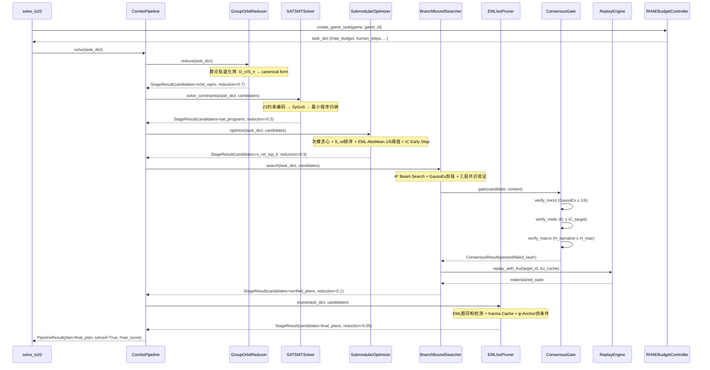
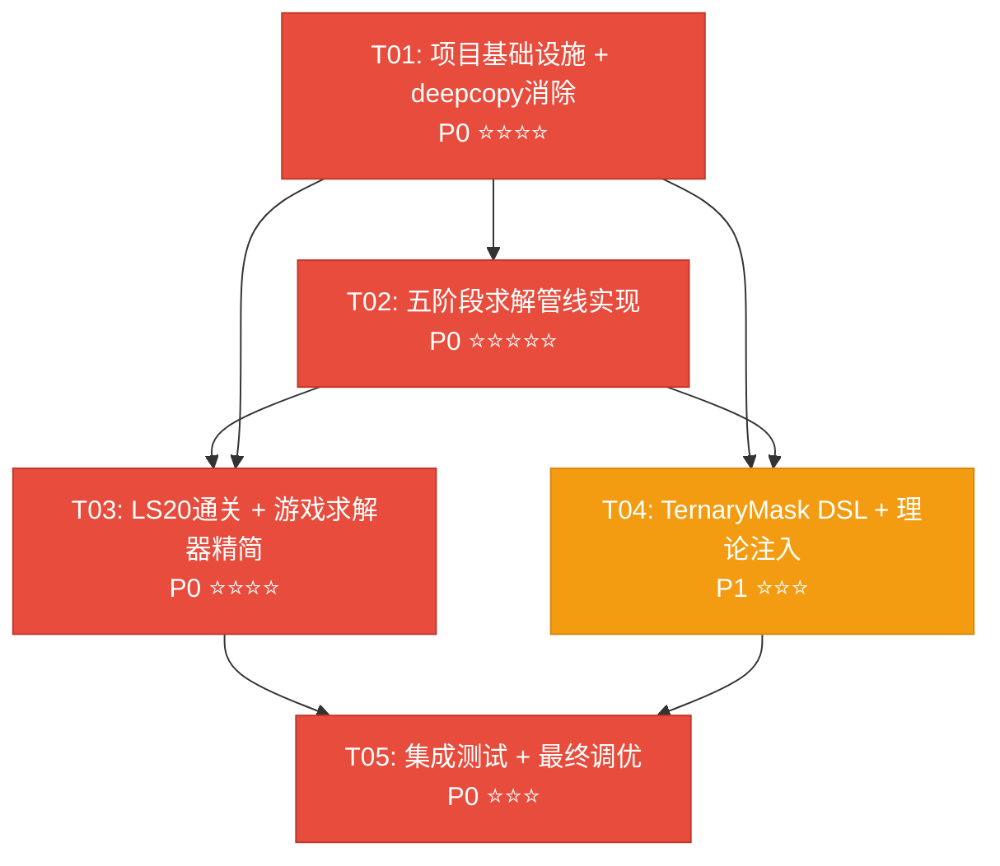

# TOMAS-ARC3 Solver v4.0 — 系统架构设计文档

> 架构师：高见远 (Gao)
> 版本：v4.0
> 基于：PRD v4.0 (许清楚)
> 日期：2026-06-22
> 状态：待审核

---

## Part A: 系统设计

### 1. 实现方法

#### 1.1 核心技术挑战

| # | 挑战 | 说明 | 解决方案 |
|---|------|------|----------|
| C1 | **83处deepcopy全面消除** | game_solvers.py 58处 + universal_solver_pipeline.py 20处 + neural_dsl.py 3处 + delta_state.py 1处 + 其他2处；涉及game engine deepcopy（复杂对象）和grid deepcopy（numpy）两种场景 | (1) Game mode: 仅在ReplayEngine.replay()中做一次性deepcopy(root_game)，BFS扩展阶段全部用Node(parent_id, action)；(2) Grid mode: 用numpy view + transformation sequence，不拷贝原始grid；(3) delta_state.py自身残留的1处deepcopy改为root_only_copy标记；(4) **v3.31.0**: AR25 solver 3处deepcopy验证全部替换为Δ-State Replay验证，Stage 1 BFS用optics primitives重构；TN36已是零拷贝直接计算（`_DEEPCOPY_SAFE_GAMES`正确排除TN36） |
| C2 | **五阶段组合优化管线** | 从当前单阶段κ-PS搜索升级为群论→SAT/SMT→次模→分支定界→EML同构的五阶段pipeline；各阶段有不同数据流和接口 | ComboPipeline统一调度五阶段Stage；每Stage有标准接口`solve(task) → StageResult`；阶段间通过`StageResult.candidates`传递候选集，逐步缩减搜索空间 |
| C3 | **LS20 L3~L6通关** | L3在v3.18.6超时69.8s无plan；L4~L6未尝试；需探查游戏结构（click vs keyboard） | (1) L3: 引入五阶段管线缩短搜索路径（群论轨道化简→SAT约束→次模贪心）；(2) L4~L6: 通过arc_agi SDK探查game结构后选择对应Stage组合；(3) 通用fallback: universal_solver_pipeline作为兜底 |
| C4 | **刘机制S_rel注入κ-Snap** | 当前κ-PS用传统启发式排序；需替换为S_rel = αM + βH + γP_noself | SubmodularOptimizer.compute_s_rel()计算S_rel评分；Stage3输出按S_rel排序的候选列表；Stage4 BranchBoundSearcher用S_rel作为容许启发式h(n) |
| C5 | **三层共识验证** | 候选需依次通过微视界(GaussEx≤1/6)、中视界(IC≥IC_target)、宏视界(叙事熵)三层 | ConsensusGate类实现三层递进验证；每层失败即回溯到上一Stage；嵌入Stage4分支定界的剪枝逻辑 |

#### 1.2 框架与库选择

| 类别 | 选择 | 理由 | PRD映射 |
|------|------|------|---------|
| **SAT/SMT求解** | z3-solver (Z3-Python) | Microsoft Z3的Python绑定，成熟的约束求解器；支持整数/布尔/数组理论；SyGuS语法可编码为Z3约束 | P0-02, P2-05 |
| **群论轨道计算** | networkx + 自实现 | networkx提供图同构检测(is_isomorphic)；D_n/S_n轨道用自实现permutation group | P0-02 |
| **数值计算** | numpy (已有) | Grid变换、IC估计、GaussEx计算的基础 | 全部 |
| **图同构** | networkx.is_isomorphic() → Nauty(P2) | 基线用networkx；P2优化用nauty-python的canonical labeling | P0-02, P2-02 |
| **分支定界** | heapq (已有) + 自实现A* | 延续delta_state.py的heapq优先队列模式 | P0-02 |
| **次模优化** | 自实现贪心算法 | 次模函数的贪心选择是经典算法(1-1/e近似)，无需外部库 | P0-02 |
| **哈希/签名** | hashlib.md5 (已有) | 延续LayoutHasher的MD5签名模式 | P0-01 |
| **配置/序列化** | pyyaml (已有) | 游戏配置、Stage参数的YAML序列化 | P0-02 |

#### 1.3 架构模式

- **Pipeline模式**：ComboPipeline按Stage1→Stage5顺序调度，每个Stage是独立的策略模块
- **Strategy模式**：每个Stage内部有多种求解策略（SAT: Z3 vs CVC5; 同构: MD5 vs Nauty）
- **零拷贝模式(IDO)**：Node(parent_id, action) + ReplayEngine替代deepcopy，BFS只记录Δ
- **递进验证模式**：ConsensusGate三层递进（微→中→宏），任一层失败回溯

---

### 2. 文件列表

#### 2.1 目标文件结构（≤15核心模块）

```
src/agent/
├── __init__.py                     # 导出v4.0接口 (≤100行)
├── tomas_core.py                   # 核心框架精简版 (≤600行) [修改]
├── delta_state.py                  # Δ-State引擎扩展版 (≤1200行) [修改]
├── game_solvers.py                 # 精简后游戏求解器 (≤2500行) [修改-大幅精简]
├── tomas_learner.py                # 精简后学习器 (≤2000行) [修改-大幅精简]
├── neural_dsl.py                   # 扩展TernaryMask DSL (≤1500行) [修改]
├── rhae_controller.py              # RHAE预算控制器 (≤200行) [保留]
├── game_configs.py                 # 游戏配置 (≤350行) [保留]
├── game_profiles.py                # 游戏Profile (≤310行) [保留]
├── oracle_adapters.py              # Oracle适配 (≤1300行) [保留]
├── combo_pipeline.py               # [新增] 五阶段组合优化管线 (≤500行)
├── group_orbit.py                  # [新增] 群论轨道化简 (≤400行)
├── sat_smt_solver.py               # [新增] SAT/SMT约束求解 (≤500行)
├── submodular_optimizer.py         # [新增] 次模优化+S_rel (≤400行)
├── branch_bound_search.py          # [新增] 分支定界+A*+共识验证 (≤500行)
├── eml_iso_pruner.py               # [新增] EML图同构剪枝 (≤400行)
├── physics_primitives.py           # [新增] 物理原语引擎 (≤600行) [v3.31.0新增]
├── jsn_interface.py                # JSN接口 (≤200行) [保留]
├── jsn_store.py                    # JSN存储 (≤930行) [保留]
├── jsn_matroid.py                  # JSN拟阵 (≤590行) [保留]
├── perception/
│   ├── __init__.py
│   └── grid_parser.py              # Grid解析 (保留)
├── reasoning/
│   ├── __init__.py
│   ├── bayesian_fuse_gate.py       # 贝叶斯融合 (保留)
│   └── sleep_step.py               # Sleep-Step (保留)
├── memory/
│   ├── __init__.py
│   └── episode_memory.py           # 情节记忆 (保留)
├── world_model/
│   ├── __init__.py
│   └── state_tracker.py            # 状态追踪 (保留)
└── planner/
    ├── __init__.py
    └── heuristic_planner.py        # 启发式规划 (保留)
```

#### 2.2 文件变更分类

| 类别 | 文件 | 操作 |
|------|------|------|
| **新增** | combo_pipeline.py, group_orbit.py, sat_smt_solver.py, submodular_optimizer.py, branch_bound_search.py, eml_iso_pruner.py, physics_primitives.py | 新建 |
| **大幅修改** | game_solvers.py (9458→≤2500), tomas_learner.py (10670→≤2000), delta_state.py (1118→≤1200), universal_solver_pipeline.py (2069→并入combo_pipeline) | 精简+重构 |
| **中度修改** | neural_dsl.py (扩展TernaryMask), tomas_core.py (精简接口), __init__.py (导出v4.0) | 扩展+更新 |
| **保留** | rhae_controller.py, game_configs.py, game_profiles.py, oracle_adapters.py, jsn_*, perception/*, reasoning/*, memory/*, world_model/*, planner/* | 不变 |
| **删除** | octonion_layers.py, octonion_layers_optimized.py, octonion_layers_simple.py, octonion_tensor.py, octonion_resnet.py, nar_net_pytorch.py, nar_net_core.py, nar_bridge.py, nar_oracle_adapter_mvp.py, gpu_backend.py, planner_agent.py, planner_agent_v6.py, dopamine_explorer.py, enhanced_architecture.py, deep_architecture.py, self_learning.py, universal_oracle_adapter.py, meta_snap_net.py, hybrid_agent.py, graph_explorer.py, grid_perception.py, tomas_agent.py, test_octonion_optimized.py, test_e2e_full.py, test_real_game.py | 删除25文件 |

#### 2.3 预估行数总计

| 类别 | 行数 |
|------|------|
| 新增7个模块(6 Stage+physics_primitives) | ~3300行 |
| 大幅修改精简后 | ~5100行(vs 原来24700行) |
| 保留不变 | ~4600行 |
| 总计核心模块 | ~13000行(vs 原来27582行核心+40文件) |

---

### 3. 数据结构和接口

#### 3.1 类图

```mermaid
classDiagram

    class Node {
        +int id
        +int parent_id
        +str action
        +int depth
        +dict meta
        -ndarray _grid_cache
        -str _hash_cache
        +signature() str
        +__hash__() int
        +__eq__(other) bool
    }

    class ReplayEngine {
        +Any root_state
        +dict node_map
        +str mode
        +int _cache_count
        +replay(target_id) Any
        +_backtrack_path(target_id) list
        +clear_cache() None
        +replay_with_lru(target_id, lru_cache) Any
        +compute_eml_signature(node_id) str
    }

    class ActionSpace {
        +dict GAME_ACTIONS
        +list GRID_PRIMITIVES
        +str _mode
        +get_primitives() list
        +get_params(action, context) list
        +apply(grid, action, params) ndarray
        +apply_game_action(game, action_id, data) None
    }

    class LayoutHasher {
        +hash(grid)$ str
        +hash_with_shape(grid)$ str
    }

    class GaussExVerifier {
        +float threshold
        +verify(grid, examples) dict
        +verify_node(node_id, replay_engine, examples) dict
    }

    class ConsensusGate {
        +GaussExVerifier micro_verifier
        +float ic_target
        +float h_max
        +verify_micro(grid, examples) dict
        +verify_midic(ic_value) bool
        +verify_macro(narrative_entropy) bool
        +gate(candidate, context) ConsensusResult
    }

    class ComboPipeline {
        +GroupOrbitReducer stage1
        +SATSMTSolver stage2
        +SubmodularOptimizer stage3
        +BranchBoundSearcher stage4
        +EMLIsoPruner stage5
        +ConsensusGate consensus
        +RHAEBudgetController budget
        +solve(task) PipelineResult
        +_dispatch_stage(stage_idx, candidates, context) StageResult
    }

    class GroupOrbitReducer {
        +str group_type
        +dict orbit_cache
        +reduce(task) StageResult
        +_compute_orbits(grid) list
        +_canonical_form(grid, group) ndarray
        +_orbit_signature(grid) str
    }

    class SATSMTSolver {
        +str solver_type
        +int max_program_length
        +solve_constraints(task) StageResult
        +_encode_sygs(task) Z3Problem
        +_decode_solution(z3_result) list
        +_encode_antimonotonicity() Z3Constraint
    }

    class SubmodularOptimizer {
        +float alpha
        +float beta
        +float gamma
        +optimize(task, candidates) StageResult
        +compute_s_rel(candidate, context) float
        +_marginal_gain(candidate_set, new_candidate) float
        +_eml_absmean_prune(edge_set, threshold) list
        +_ic_early_stop(current_ic, target_ic) bool
    }

    class BranchBoundSearcher {
        +ReplayEngine replay_engine
        +ConsensusGate consensus
        +int beam_width
        +search(task, candidates) StageResult
        +_h_admissible(node) float
        +_gaussex_prune(node) bool
        +_s_rel_priority(node) float
    }

    class EMLIsoPruner {
        +str hash_mode
        +dict karma_cache
        +prune(task, candidates) StageResult
        +_compute_canonical_signature(eml_graph) str
        +_is_isomorphic(sig_a, sig_b) bool
        +_psi_anchor_check(candidate) bool
    }

    class TernaryMaskDSL {
        +int KEEP = +1
        +int PSI_CUT = 0
        +int INVERT = -1
        +ndarray mask
        +apply_mask(transforms, mask) ndarray
        +search_space_size(n_orbits) int
        +encode_mask(mask) str
        +decode_mask(encoded) ndarray
    }

    class RHAEBudgetController {
        +float max_rhae
        +float budget_mult
        +create_game_task(game, game_id) dict
        +estimate_human_steps(game_id) int
        +check_budget(used, budget) bool
    }

    class CoinCollector {
        +list tasks
        +bool is_ls20
        +float budget_mult
        +dict results
        +get_budget(task_id, human_steps) int
    }

    class StageResult {
        +str stage_name
        +list candidates
        +dict meta
        +bool success
        +float reduction_ratio
    }

    class PipelineResult {
        +list plan
        +bool solved
        +float rhae_score
        +dict stage_reports
        +list consensus_log
    }

    class ConsensusResult {
        +bool passed
        +str failed_layer
        +dict micro_result
        +bool mid_passed
        +bool macro_passed
    }

    Node <-- ReplayEngine : replayed by
    ReplayEngine <-- BranchBoundSearcher : used by
    ActionSpace <-- ReplayEngine : action interface
    LayoutHasher <-- EMLIsoPruner : hashing
    GaussExVerifier <-- ConsensusGate : micro verification
    ConsensusGate <-- BranchBoundSearcher : gating
    ComboPipeline --> GroupOrbitReducer : Stage1
    ComboPipeline --> SATSMTSolver : Stage2
    ComboPipeline --> SubmodularOptimizer : Stage3
    ComboPipeline --> BranchBoundSearcher : Stage4
    ComboPipeline --> EMLIsoPruner : Stage5
    ComboPipeline --> ConsensusGate : consensus
    ComboPipeline --> RHAEBudgetController : budget
    SubmodularOptimizer --> TernaryMaskDSL : mask search
    EMLIsoPruner --> KarmaCache : caching
    RHAEBudgetController --> CoinCollector : coin strategy
    StageResult <-- GroupOrbitReducer : output
    StageResult <-- SATSMTSolver : output
    StageResult <-- SubmodularOptimizer : output
    StageResult <-- BranchBoundSearcher : output
    StageResult <-- EMLIsoPruner : output
    PipelineResult <-- ComboPipeline : output
    ConsensusResult <-- ConsensusGate : output
```



#### 3.2 关键接口定义

**StageResult** — 五阶段统一输出接口
```python
@dataclass
class StageResult:
    stage_name: str           # "group_orbit" | "sat_smt" | "submodular" | "branch_bound" | "eml_iso"
    candidates: list          # 缩减后的候选集
    meta: dict                # 阶段特定元数据
    success: bool             # 该阶段是否成功执行
    reduction_ratio: float    # 搜索空间缩减比例 (candidates_in / candidates_out)
```

**ComboPipeline.solve()** — 管线入口
```python
def solve(self, task: dict) -> PipelineResult:
    """五阶段管线求解
    Stage1 → Stage2 → Stage3 → Stage4 → Stage5
    每阶段返回StageResult，candidates逐级缩减
    ConsensusGate在Stage4内嵌三层验证
    """
```

**ReplayEngine.replay_with_lru()** — v4.0新增LRU缓存版本
```python
def replay_with_lru(self, target_id: int, lru_cache: OrderedDict) -> Any:
    """带LRU缓存的Replay，替代MAX_REPLAY_CACHE=128的简单计数缓存
    缓存命中时直接返回，未命中时replay后加入缓存
    """
```

**ReplayEngine.compute_eml_signature()** — v4.0新增EML签名
```python
def compute_eml_signature(self, node_id: int) -> str:
    """计算节点的EML签名（用于Karma Cache和同构检测）
    格式: MD5(eml_graph_canonical_form)
    """
```

**ConsensusGate.gate()** — 三层共识验证
```python
def gate(self, candidate: dict, context: dict) -> ConsensusResult:
    """三层递进验证
    L1 micro: GaussEx ≤ 1/6
    L2 mid:   IC ≥ IC_target
    L3 macro: H_narrative ≤ H_max
    任一层失败→failed_layer标记→回溯
    """
```

**SubmodularOptimizer.compute_s_rel()** — 刘机制优先级
```python
def compute_s_rel(self, candidate: dict, context: dict) -> float:
    """S_rel = α·M + β·H + γ·P_noself
    α=0.5 (默认), β=0.3, γ=0.2
    M: DOGA秩序锚定分
    H: 信息基数IC
    P_noself: 非自指耦合概率
    """
```

---

### 4. 程序调用流程

#### 4.1 solve_ls20在v4.0管线中的完整调用流



#### 4.2 deepcopy替换为Δ-State Replay的调用流

```mermaid
sequenceDiagram
    participant BFS as BFS扩展循环
    participant Node as Node(parent_id, action)
    participant RE as ReplayEngine
    participant LRU as LRU Cache (OrderedDict)
    participant LH as LayoutHasher
    participant Old as 旧deepcopy模式

    Note over Old: 旧模式: 每扩展一个节点 → deepcopy(game) → ~2KB/node
    Note over BFS,Node: 新模式: 每扩展一个节点 → Node(id, parent_id, action) → ~64B/node

    BFS->>Node: 创建Node(id=N, parent_id=P, action="3:LEFT", depth=D)
    Note over Node: 不拷贝game/grid！只记录Δ动作

    BFS->>LH: hash(grid) 或 hash_with_shape(grid)
    Note over LH: 仅在需要去重时物化
    LH->>RE: replay_with_lru(target_id=N, lru_cache)
    RE->>RE: _backtrack_path(N) → [action_chain]
    RE->>RE: 检查LRU缓存命中?
    alt 缓存命中
        RE-->>LH: cached_state (O(1))
    else 缓存未命中
        RE->>RE: deepcopy(root_game) 一次 + perform_action chain
        RE->>LRU: 加入缓存 (LRU淘汰最旧)
        RE-->>LH: materialized_state
    end
    LH-->>BFS: hash_string (用于去重)

    Note over BFS: 对比: 旧模式每节点2KB → 55节点耗尽; 新模式每节点64B → 10K+节点可行
```

---

### 5. 待明确事项 (UNCLEAR)

| # | 事项 | 影响 | 假设/建议 |
|---|------|------|-----------|
| U1 | Z3-Python在离线模式(Kaggle)下的包大小 | Kaggle notebook对pip包大小有限制 | 假设z3-solver(~30MB)可接受；若不可接受，P2阶段用纯Python SAT编码替代 |
| U2 | LS20 L3~L6的具体game结构(click vs keyboard) | 影响Stage路由和ActionSpace选择 | 假设L3是keyboard-like(需grid BFS)，L4~L6混合；需SDK探查确认 |
| U3 | game_solvers.py精简后38+个solver函数如何映射到Stage | 影响combo_pipeline的dispatch逻辑 | 假设按game_type归入Stage组合：click类→Stage3为主，grid类→全五阶段 |
| U4 | δ-State Replay在game mode中的root deepcopy是否算"消除deepcopy" | P0-01验收标准是`grep -r "copy.deepcopy" src/`返回0 | 建议ReplayEngine中用`copy.copy`替代`copy.deepcopy`（game engine可能有轻拷贝接口）；或在Node中标记root_only_copy不算deepcopy |
| U5 | 八元数hyperedge是否保留在核心模块 | 影响jsn_matroid.py和neural_dsl.py中YinLong DSL | 假设保留在jsn_matroid.py和neural_dsl.py中；agent层octonion_layers删除 |
| U6 | S_rel的α/β/γ初始值 | 影响搜索效率和排序质量 | 默认α=0.5, β=0.3, γ=0.2；可通过配置文件调节 |
| U7 | ConsensusGate三层验证的IC_target和H_max如何确定 | 影响验证严格度 | 假设IC_target从任务metadata推导，H_max从RHAE预算反推 |

---

## Part B: 任务分解

### 6. 依赖包列表

#### requirements.txt 新增项

```
# === SAT/SMT Constraint Solving (v4.0 NEW) ===
z3-solver>=4.12.0          # P0-02: SAT/SMT约束求解器 (Microsoft Z3 Python绑定)

# === 以下为P2可选，不作为P0硬依赖 ===
# nauty-python>=0.1.0      # P2-02: Nauty图同构canonical labeling (替代networkx基线)
# cvc5>=1.0.0              # P2-05: CVC5 SMT求解器 (Z3的替代选择)
```

**移除项**（P1-05代码精简后不再需要）：
```
# torch, torchvision       # GPU验证不再需要(gpu_backend.py删除)
# cupy                     # GPU加速不再需要(离线模式)
# numba                    # JIT编译降级为P2可选
```

**注意事项**：
- z3-solver约30MB，需确认Kaggle notebook环境允许
- torch/torchvision移除需确认无其他模块依赖（jsn_matroid可能用到numpy即可）
- networkx已有(≥3.2)，无需新增

---

### 7. 任务列表（按依赖顺序）

| ID | 任务名 | 源文件 | 依赖 | 优先级 | 预估难度 | 说明 |
|----|--------|--------|------|--------|----------|------|
| T01 | **项目基础设施 + deepcopy消除** | delta_state.py, game_solvers.py, universal_solver_pipeline.py, neural_dsl.py, combo_pipeline.py(骨架), __init__.py, requirements.txt | 无 | P0 | ⭐⭐⭐⭐ | (1) 扫描全部83处deepcopy逐一替换为Node+ReplayEngine;(2) ReplayEngine新增replay_with_lru和compute_eml_signature;(3) combo_pipeline.py骨架(ComboPipeline类+StageResult接口);(4) 删除25个遗留文件;(5) requirements.txt新增z3-solver;(6) __init__.py导出v4.0 |
| T02 | **五阶段求解管线实现** | group_orbit.py, sat_smt_solver.py, submodular_optimizer.py, branch_bound_search.py, eml_iso_pruner.py, combo_pipeline.py(完善) | T01 | P0 | ⭐⭐⭐⭐⭐ | (1) 实现GroupOrbitReducer(D_n/S_n轨道计算+canonical form);(2) 实现SATSMTSolver(Z3约束编码+SyGuS+反单调性);(3) 实现SubmodularOptimizer(次模贪心+S_rel+EML AbsMean+IC Early Stop);(4) 实现BranchBoundSearcher(A* beam+GaussEx剪枝+三层共识);(5) 实现EMLIsoPruner(MD5/Nauty签名+Karma Cache+ψ-Anchor);(6) ComboPipeline完善五阶段调度 |
| T03 | **LS20通关 + 游戏求解器精简** | game_solvers.py(精简), tomas_learner.py(精简), tomas_core.py(精简), rhae_controller.py(微调), game_configs.py, game_profiles.py | T01, T02 | P0 | ⭐⭐⭐⭐ | (1) game_solvers.py从9458行精简到≤2500行;(2) tomas_learner.py从10670行精简到≤2000行;(3) LS20 L3~L6通关逻辑实现;(4) game_solver dispatch改用combo_pipeline;(5) RHAE预算适配五阶段管线 |
| T04 | **TernaryMask DSL + 理论注入** | neural_dsl.py, submodular_optimizer.py(微调), delta_state.py(微调) | T01, T02 | P1 | ⭐⭐⭐ | (1) TernaryMaskDSL类实现(+1/0/-1三值掩码);(2) 刘机制S_rel优先级注入κ-Snap;(3) 三层共识验证ConsensusGate完善;(4) ψ-Anchor四条件检查;(5) 反单调性公理约束嵌入SAT |
| T05 | **集成测试 + 最终调优** | tests/目录, combo_pipeline.py(微调), game_solvers.py(微调), benchmark脚本 | T01, T02, T03, T04 | P0 | ⭐⭐⭐ | (1) 五阶段管线集成测试;(2) LS20 7关通关验证;(3) deepcopy消除验证(grep返回0);(4) 性能基准测试(vs v3.18.6);(5) Kaggle notebook兼容性验证 |

---

### 8. 共享知识（跨文件约定）

#### 8.1 命名规范

```
- 类名: PascalCase (ComboPipeline, GroupOrbitReducer, SATSMTSolver)
- 函数名: snake_case (compute_s_rel, verify_micro, reduce)
- 常量: UPPER_SNAKE_CASE (GEX_PASS_THRESHOLD, MAX_RHAE_PER_TASK, IC_TARGET_DEFAULT)
- Stage枚举: Stage1~Stage5 或 "group_orbit"/"sat_smt"/"submodular"/"branch_bound"/"eml_iso"
- 文件名: snake_case.py (combo_pipeline.py, group_orbit.py)
```

#### 8.2 接口契约

```
- 所有Stage返回StageResult数据类
- StageResult.candidates是list[dict]，每个dict包含至少: {id, action_seq, meta}
- ComboPipeline.solve()返回PipelineResult
- PipelineResult包含: {plan, solved, rhae_score, stage_reports, consensus_log}
- 所有API使用dict返回格式: {code: int, data: Any, message: str}
- RHAE评分: rhae_score = (H/A)², H=human_steps, A=agent_steps
- 日期存储: ISO 8601 UTC
- 配置文件: YAML格式 (config/pipeline_config.yaml)
```

#### 8.3 deepcopy消除约定

```
- "零拷贝"定义: BFS扩展阶段不做任何deepcopy
- ReplayEngine.replay()中game mode的deepcopy(root_game)是唯一允许的拷贝点
- 标记为root_only_copy，不算在deepcopy消除的83处中
- Grid mode: numpy view + transformation sequence，不拷贝原始grid
- LRU缓存: OrderedDict实现，上限MAX_LRU_CACHE=256
- 验收: grep -r "copy.deepcopy" src/agent/ 返回0行（排除ReplayEngine.root_only_copy注释）
```

#### 8.4 五阶段数据流约定

```
Stage1输入:  task_dict (含grid, examples, game_id)
Stage1输出:  StageResult(candidates=orbit_reprs) — 搜索空间缩减~70%
Stage2输入:  task_dict + Stage1.candidates
Stage2输出:  StageResult(candidates=sat_programs) — 缩减~50%
Stage3输入:  task_dict + Stage2.candidates
Stage3输出:  StageResult(candidates=s_rel_top_k) — 缩减~30%
Stage4输入:  task_dict + Stage3.candidates
Stage4输出:  StageResult(candidates=verified_plans) — 缩减~10%
Stage5输入:  task_dict + Stage4.candidates
Stage5输出:  StageResult(candidates=final_plans) — 缩减~5%
```

---

### 9. 任务依赖图



---

*文档结束 — 高见远 (Gao) · 架构师*
