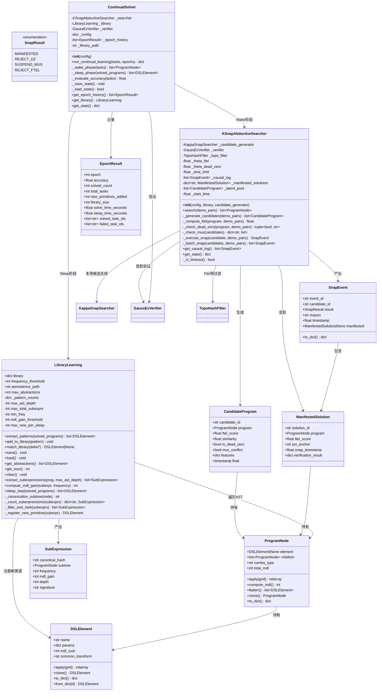
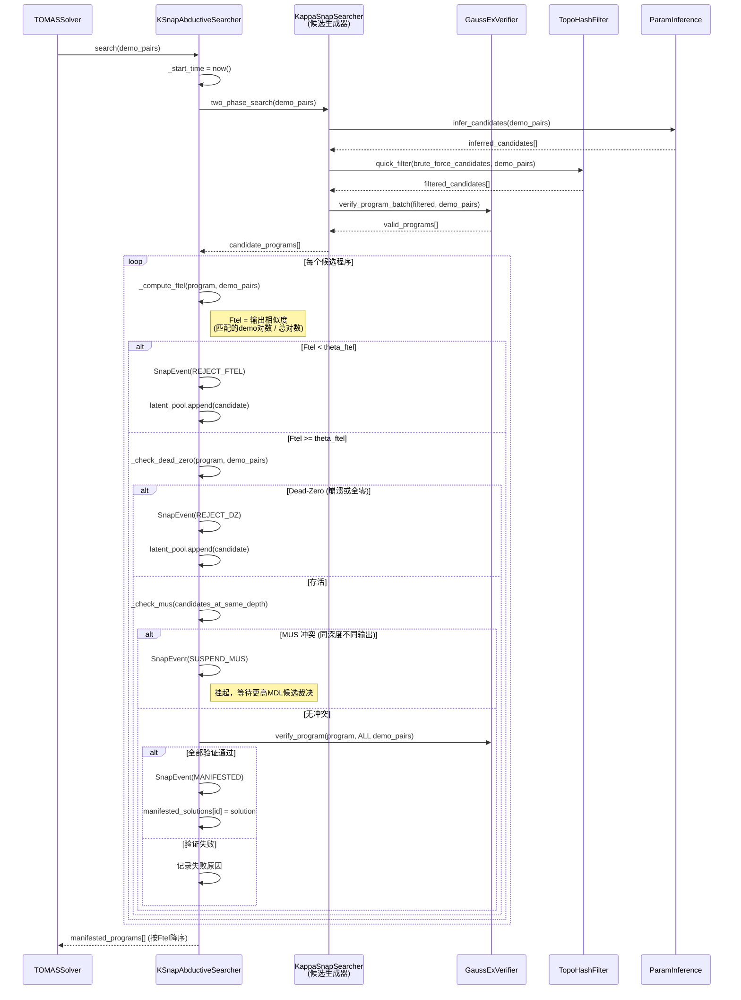
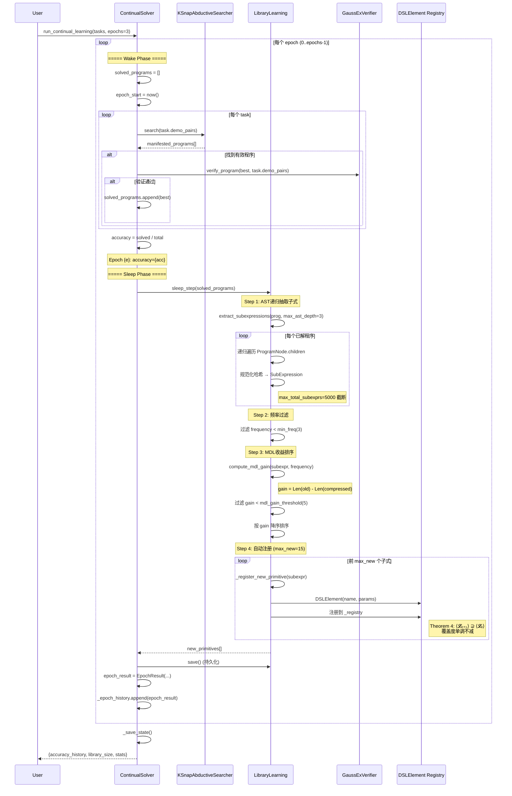
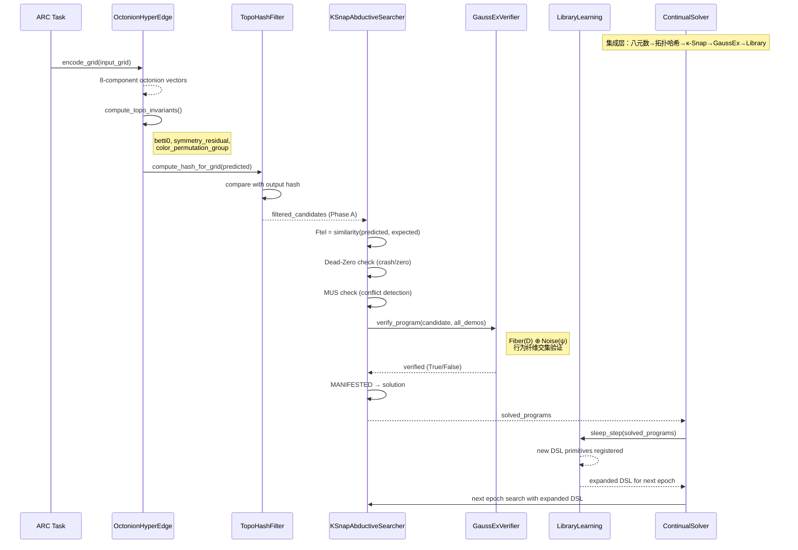
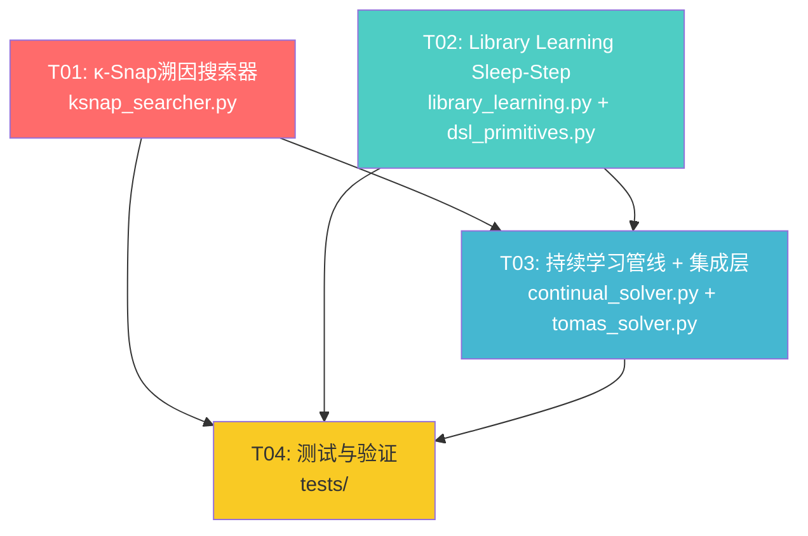

# 系统设计：太一理论核心 + 持续学习机制集成方案

> **项目**: tomas-arc3-solver v2.6 → v2.7
> **架构师**: 高见远
> **日期**: 2026-06-22
> **目标**: 从 18% (9/50) 准确率提升至 68%+

---

## Part A: 系统设计

### 1. 实现方案

#### 1.1 核心技术挑战

| 挑战 | 描述 | 解决方案 |
|------|------|---------|
| **候选爆炸** | 53个原语 × 3层组合 = ~150K 候选，验证成本高 | κ-Snap 四级过滤（Ftel→DZ→MUS→Projection），逐级淘汰 |
| **AST子式抽取** | ProgramNode 树形递归遍历，子树同构判定 | 规范化哈希 + 深度限制(max_ast_depth=3) + 总量上限(5000) |
| **DSL覆盖单调性** | Theorem 4 要求 ⟨𝓛ₑ₊₁⟩ ⊇ ⟨𝓛ₑ⟩ | Sleep-Step 只增不删原语，旧原语保留 |
| **持续学习闭环** | Wake→Sleep→Wake 跨 epoch 状态传递 | ContinualSolver 持有 Library + Searcher 引用，epoch 间共享状态 |
| **接口兼容** | 新搜索器需替换现有 KappaSnapSearcher | KSnapAbductiveSearcher 实现相同 `search(demo_pairs) -> list[ProgramNode]` 接口 |

#### 1.2 框架与库选型

| 组件 | 选型 | 理由 |
|------|------|------|
| 数值计算 | numpy + scipy.ndimage (现有) | 网格操作基础，项目已深度依赖 |
| JIT加速 | numba (现有) | 热路径kernel加速，可选CUDA |
| 并发验证 | concurrent.futures.ThreadPoolExecutor (现有) | Phase B 并行验证，无需引入新依赖 |
| 序列化 | json (现有) | Library 持久化，与现有 LibraryLearning.save() 一致 |
| 日志 | logging (标准库) | κ-Snap 因果日志，与 tomas-agi 风格一致 |

**不引入新第三方依赖**，全部使用项目已有技术栈。

#### 1.3 架构模式

采用 **管道-过滤器 (Pipeline-Filter)** 模式 + **编排器 (Orchestrator)** 模式：

```
ContinualSolver (Orchestrator)
  ├── Wake Phase: KSnapAbductiveSearcher.search() → solved_programs
  ├── Sleep Phase: LibraryLearning.sleep_step() → new_primitives
  │     ├── extract_subexpressions() → AST子式列表
  │     ├── 频率过滤 (min_freq=3)
  │     ├── MDL收益排序 (mdl_gain_threshold=5)
  │     └── 自动注册 (max_new=15)
  └── Next Epoch: 扩展DSL → 重新搜索
```

---

### 2. 文件列表

#### 新增文件

| 文件路径 | 说明 |
|---------|------|
| `src/solver/ksnap_searcher.py` | κ-Snap溯因搜索器（适配 tomas-agi 的 KSnapOperator 到 ARC 求解） |
| `src/solver/continual_solver.py` | 持续学习管线（Wake-Sleep 循环编排） |

#### 修改文件

| 文件路径 | 修改内容 |
|---------|---------|
| `src/solver/library_learning.py` | 新增 `extract_subexpressions()`, `compute_mdl_gain()`, `sleep_step()` 方法；新增爆炸控制参数 |
| `src/solver/tomas_solver.py` | 新增 `solve_continual()` 方法，集成 ContinualSolver |

#### 参考文件（不修改，仅复用）

| 文件路径 | 复用点 |
|---------|--------|
| `src/core/dsl_primitives.py` | ProgramNode 树结构、DSLElement 注册表 |
| `src/core/octonion_hyperedge.py` | OctonionHyperEdge 编码、拓扑不变量 |
| `src/core/topo_hash.py` | TopoHashFilter 候选过滤 |
| `src/solver/gaussex_verifier.py` | GaussExVerifier 验证、fiber intersection |
| `src/solver/param_inference.py` | ParamInference 候选生成 |
| `src/solver/kappa_snap_searcher.py` | 现有 KappaSnapSearcher（作为候选生成器被复用） |

---

### 3. 数据结构和接口（类图）



---

### 4. 程序调用流程（时序图）

#### 4.1 κ-Snap 溯因搜索流程



#### 4.2 Wake-Sleep 持续学习流程



#### 4.3 集成层数据流



---

### 5. 待明确事项

#### 5.1 beam_search_v5.py 接口兼容

任务描述提到"需要与现有beam_search_v5.py的solve_task_beam_v5接口兼容"，但项目中不存在 `beam_search_v5.py` 文件。现有的搜索器是 `kappa_snap_searcher.py` 中的 `KappaSnapSearcher`，其接口为 `search(demo_pairs) -> list[ProgramNode]`。

**假设**: 新的 `KSnapAbductiveSearcher` 将实现与 `KappaSnapSearcher.search()` 相同的签名，作为 drop-in 替换。如果后续发现 `beam_search_v5.py` 的接口不同，需要调整适配层。

#### 5.2 新原语的 apply() 实现

`sleep_step()` 注册的新原语需要具备 `apply(grid)` 能力。当前 `DSLElement._registry` 是函数名到实现函数的映射。新原语有两种策略：

- **策略A（推荐）**: 新原语本质上是子树的命名别名，其 `apply()` 通过展开原始子树执行。需在 `DSLElement` 中新增 `subtree: ProgramNode | None` 属性，当 `subtree` 非空时 `apply()` 委托给 `subtree.apply()`。
- **策略B**: 将子树展平为单个复合函数注册到 `_registry`。更简单但丧失了 MDL 优势。

**假设**: 采用策略A，需小幅修改 `DSLElement.apply()` 方法以支持子树委托。

#### 5.3 MUS 冲突判定的粒度

MUS（Mutually Unconflicting Stable）在 tomas-agi 中是"同深度但产出不同输出的候选"。在 ARC 场景下，"深度"可映射为：
- ProgramNode 的 `compute_mdl()` 值（MDL相同则视为同深度）
- 或 `flatten()` 后的元素数量

**假设**: 使用 MDL 值作为深度代理，MDL 相同（容差 ±2）的候选如果产出不同输出，则标记为 MUS 冲突。选择 Ftel 更高的候选作为胜者。

#### 5.4 持续学习的任务分割

`run_continual_learning(tasks, epochs=3)` 中的 `tasks` 是全部任务还是分批？

**假设**: 传入全部任务，每个 epoch 对全部任务重新求解。Sleep 阶段从所有已解程序中提取子式。这样可以验证 Theorem 4 的覆盖度单调性。

---

## Part B: 任务分解

### 6. 依赖包列表

```
# 无新增第三方依赖，全部使用项目已有依赖
- numpy>=1.24.0: 网格数值计算 (现有)
- scipy>=1.10.0: ndimage 连通组件分析 (现有)
- numba>=0.57.0: JIT 加速热路径 (可选, 现有)
- json (标准库): Library 持久化
- logging (标准库): 因果日志
- time (标准库): 时间戳与超时控制
- uuid (标准库): 候选ID生成
- dataclasses (标准库): 数据结构定义
- enum (标准库): SnapResult 枚举
- concurrent.futures (标准库): 并行验证
```

---

### 7. 任务列表（按依赖排序）

#### T01: κ-Snap 溯因搜索器 + 数据结构

- **任务名**: 实现 κ-Snap 溯因搜索器及配套数据结构
- **源文件**:
  - `src/solver/ksnap_searcher.py` (新增)
- **依赖**: 无（复用现有 KappaSnapSearcher, GaussExVerifier, TopoHashFilter, ParamInference）
- **优先级**: P0
- **描述**:
  - 定义 `SnapResult` 枚举（MANIFESTED/REJECT_DZ/SUSPEND_MUS/REJECT_FTEL）
  - 定义 `CandidateProgram`, `ManifestedSolution`, `SnapEvent` 数据类
  - 实现 `KSnapAbductiveSearcher` 类：
    - `__init__(config, library, candidate_generator)` — 接收现有 KappaSnapSearcher 实例作为候选生成器
    - `search(demo_pairs) -> list[ProgramNode]` — 主入口，与 KappaSnapSearcher.search() 签名兼容
    - `_generate_candidates(demo_pairs)` — 委托 candidate_generator 生成候选
    - `_compute_ftel(program, demo_pairs) -> float` — 计算输出相似度（匹配demo对数/总对数）
    - `_check_dead_zero(program, demo_pairs) -> tuple[bool, str]` — 检测崩溃或全零输出
    - `_check_mus(candidates) -> dict` — 检测同MDL不同输出的冲突候选
    - `_execute_snap(candidate, demo_pairs) -> SnapEvent` — 执行单次κ-Snap投影
    - `get_causal_log() -> list[SnapEvent]` — 获取因果日志
    - `get_stats() -> dict` — 统计信息
  - 四级过滤流水线：Ftel阈值 → Dead-Zero → MUS → GaussEx投影验证
  - 因果日志记录，支持回溯分析

#### T02: Library Learning Sleep-Step 升级

- **任务名**: 为 LibraryLearning 新增 AST 子式抽取与 Sleep-Step 编排
- **源文件**:
  - `src/solver/library_learning.py` (修改)
  - `src/core/dsl_primitives.py` (修改 — DSLElement 新增 subtree 属性)
- **依赖**: T01（KSnapAbductiveSearcher 产出的 solved_programs 作为 sleep_step 输入）
- **优先级**: P0
- **描述**:
  - 新增 `SubExpression` 数据类（canonical_hash, subtree, frequency, mdl_gain, depth）
  - 修改 `LibraryLearning.__init__()` 新增爆炸控制参数：
    - `max_ast_depth=3`, `max_total_subexprs=5000`, `min_freq=3`
    - `mdl_gain_threshold=5`, `max_new_per_sleep=15`
  - 实现 `extract_subexpressions(prog, max_ast_depth=3) -> list[SubExpression]`:
    - 递归遍历 `ProgramNode.children`
    - 子树规范化哈希（`_canonicalize_subtree`）：元素名+参数+组合类型
    - 深度截断 + 总量截断
  - 实现 `compute_mdl_gain(subexpr, frequency) -> int`:
    - `gain = Len(展开后) * frequency - Len(压缩后) * frequency - 注册开销`
  - 实现 `sleep_step(solved_programs) -> list[DSLElement]`:
    - Step 1: 对每个已解程序调用 `extract_subexpressions()`
    - Step 2: 合并去重，频率过滤（`min_freq`）
    - Step 3: MDL收益计算 + 排序 + 阈值过滤（`mdl_gain_threshold`）
    - Step 4: 取前 `max_new_per_sleep` 个，调用 `_register_new_primitive()`
    - 返回新增的 DSLElement 列表
  - 实现 `_register_new_primitive(subexpr) -> DSLElement`:
    - 创建新 DSLElement，设置 `subtree` 属性
    - 注册到 `DSLElement._registry`（以 `learned_{hash[:8]}` 命名）
  - 修改 `DSLElement`：
    - 新增 `subtree: ProgramNode | None = None` 属性
    - 修改 `apply()` 方法：当 `subtree` 非空时委托 `subtree.apply(grid)`

#### T03: 持续学习管线 + 集成层

- **任务名**: 实现 ContinualSolver Wake-Sleep 循环及 TOMASSolver 集成
- **源文件**:
  - `src/solver/continual_solver.py` (新增)
  - `src/solver/tomas_solver.py` (修改 — 新增 solve_continual 方法)
- **依赖**: T01, T02
- **优先级**: P0
- **描述**:
  - 定义 `EpochResult` 数据类（epoch, accuracy, solved_count, total_tasks, new_primitives_added, library_size, solve_time, sleep_time, solved_task_ids, failed_task_ids）
  - 实现 `ContinualSolver` 类：
    - `__init__(config)` — 初始化 searcher, library, verifier；加载持久化状态
    - `run_continual_learning(tasks, epochs=3) -> dict`:
      - 循环 epochs 次：
        - **Wake Phase**: 对每个 task 调用 `searcher.search(demo_pairs)`，收集 solved_programs
        - **Sleep Phase**: 调用 `library.sleep_step(solved_programs)` 提取新原语
        - 记录 EpochResult（accuracy, timing, new primitives count）
        - 保存库状态 `library.save()`
      - 返回 `{accuracy_history, final_accuracy, library_size, epoch_details, total_new_primitives}`
    - `_wake_phase(tasks) -> list[ProgramNode]` — Wake 阶段封装
    - `_sleep_phase(solved_programs) -> list[DSLElement]` — Sleep 阶段封装
    - `_evaluate_accuracy(tasks) -> float` — 当前 epoch 准确率
    - `_save_state() / _load_state()` — 持久化 ContinualSolver 状态（epoch_history, library）
    - `get_epoch_history() -> list[EpochResult]` — 获取训练历史
    - `get_stats() -> dict` — 统计信息
  - 集成层实现（在 ContinualSolver 内部）：
    - 八元数编码 → 拓扑哈希：由 KSnapAbductiveSearcher 内部的 candidate_generator 自动完成
    - GaussEx 验证 → κ-Snap 投影：由 KSnapAbductiveSearcher._execute_snap() 调用 GaussExVerifier
    - Library Learning → Sleep-Step → 扩展 DSL → 下一轮搜索：ContinualSolver 编排
  - 修改 `TOMASSolver`：
    - 新增 `solve_continual(tasks, epochs=3) -> dict` 方法
    - 在 `__init__` 中可选初始化 ContinualSolver

#### T04: 测试与验证

- **任务名**: 编写集成测试验证持续学习管线正确性
- **源文件**:
  - `tests/test_ksnap_searcher.py` (新增)
  - `tests/test_library_sleep.py` (新增)
  - `tests/test_continual_solver.py` (新增)
- **依赖**: T01, T02, T03
- **优先级**: P1
- **描述**:
  - `test_ksnap_searcher.py`:
    - 测试四级过滤：Ftel不足拒绝、Dead-Zero拒绝、MUS挂起、正常显影
    - 测试因果日志完整性
    - 测试与 KappaSnapSearcher 接口兼容性
  - `test_library_sleep.py`:
    - 测试 `extract_subexpressions` 递归遍历正确性
    - 测试 `compute_mdl_gain` 计算正确性
    - 测试 `sleep_step` 爆炸控制（max_ast_depth, max_total_subexprs, min_freq, max_new）
    - 测试 Theorem 4：新原语注册后 DSL 覆盖度不减
  - `test_continual_solver.py`:
    - 测试 Wake-Sleep 循环多 epoch 准确率跟踪
    - 测试库持久化 save/load
    - 测试集成层数据流完整性

---

### 8. 共享知识（跨文件约定）

```
# === 接口约定 ===
- 所有搜索器实现 search(demo_pairs: list[dict]) -> list[ProgramNode] 接口
- demo_pairs 格式: [{"input": [ndarray], "output": [ndarray]}, ...]
- 返回的 ProgramNode 列表按质量降序排列（MDL升序 或 Ftel降序）

# === κ-Snap 映射约定 ===
- 候选程序 = CandidateProgram（包装 ProgramNode + 元数据）
- Ftel = 输出相似度 = (匹配的demo对数 / 总demo对数)，范围 [0.0, 1.0]
- Dead-Zero = program.apply(grid) 抛异常 OR 输出全零
- MUS = 同 MDL（容差±2）但不同输出的候选对
- θ_ftel = 0.1（Ftel 低于此值直接拒绝）
- θ_dead_zero = 0.0（输出全零即拒绝）
- MANIFESTED = 通过所有 demo 对验证

# === Library Learning 约定 ===
- 新原语命名: "learned_{canonical_hash[:8]}"
- 新原语的 mdl_cost = max(1, 原子树MDL // 2)（压缩50%）
- SubExpression 规范化哈希: "{element.name}:{sorted(params.items())}|{combo_type}|{children_hashes}"
- sleep_step 每次最多注册 15 个新原语（max_new_per_sleep=15）
- 爆炸控制: max_ast_depth=3, max_total_subexprs=5000, min_freq=3, mdl_gain_threshold=5

# === 持续学习约定 ===
- EpochResult.accuracy = solved_count / total_tasks
- Library 持久化路径: config["library"]["persistence_path"] (默认 "library.json")
- ContinualSolver 状态路径: config["continual"]["state_path"] (默认 "continual_state.json")
- Theorem 4 保证: 新原语只增不删，⟨𝓛ₑ₊₁⟩ ⊇ ⟨𝓛ₑ⟩

# === 错误处理 ===
- 所有 program.apply() 调用必须 try-except 包裹
- 异常程序视为 Dead-Zero，记入 REJECT_DZ
- Library save/load 失败时静默降级（不阻断主流程）
- 搜索超时返回当前已找到的最佳候选

# === 日志约定 ===
- κ-Snap 因果日志: SnapEvent.to_dict() → JSON 序列化
- Epoch 历史: EpochResult 存入 _epoch_history 列表
- 关键决策点使用 logging.INFO，调试信息使用 logging.DEBUG
```

---

### 9. 任务依赖图



**说明**:
- T01 和 T02 可并行开发（无相互依赖）
- T03 依赖 T01 和 T02 完成后才能集成
- T04 依赖前三个任务全部完成
- 关键路径: T01 → T03 → T04（或 T02 → T03 → T04）
