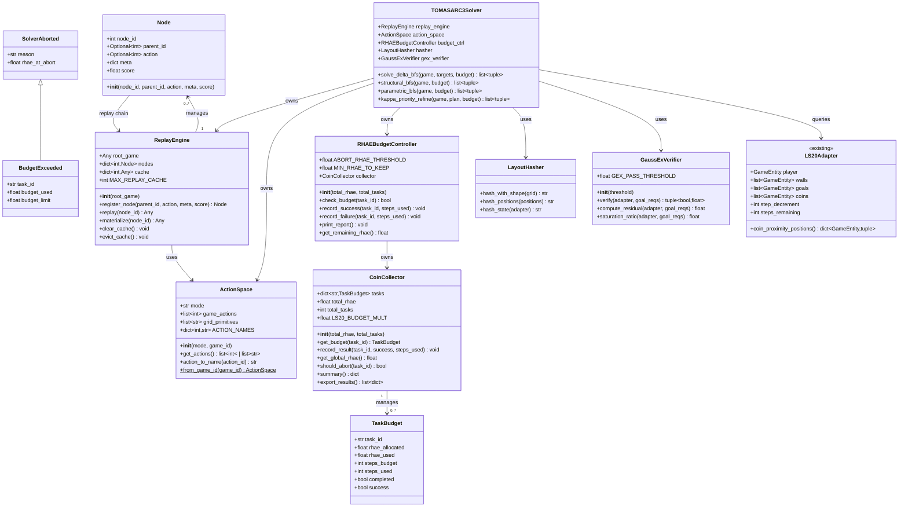
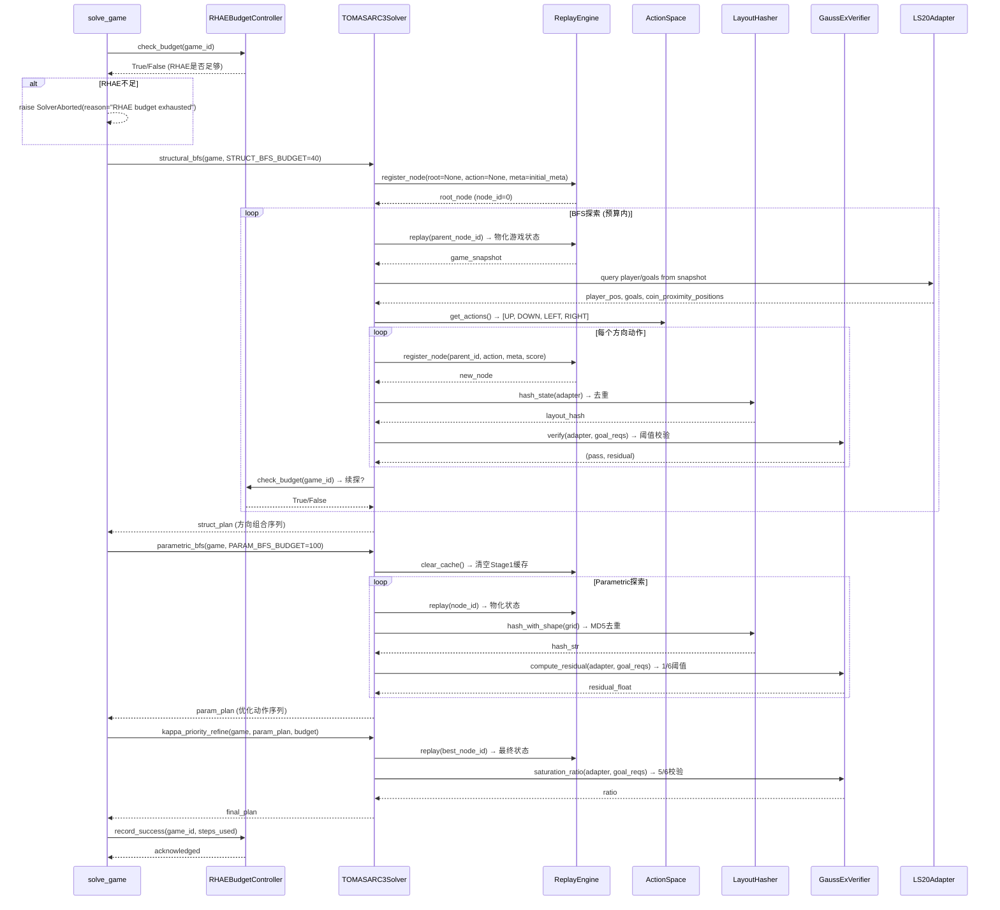
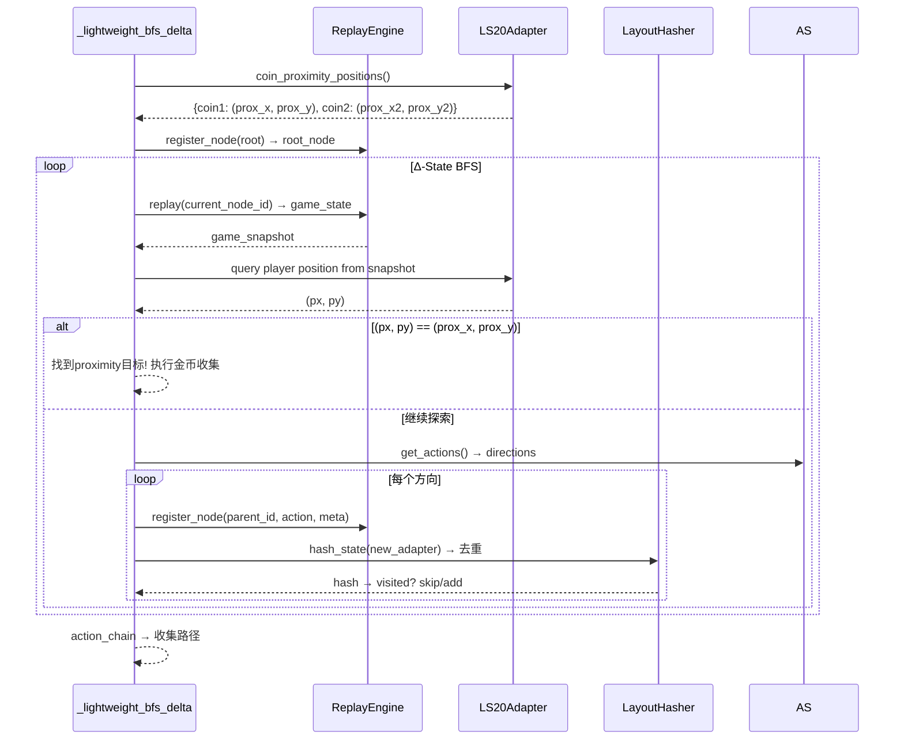
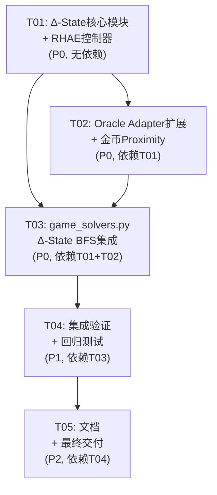

# TOMAS-ARC3-Solver Δ-State 集成架构设计

> 版本: v3.14.0 | 架构师: 高见远 (Gao) | 日期: 2026-06-27

---

## Part A: 系统设计

### 1. 实现方案

#### 核心技术挑战

1. **deepcopy 性能瓶颈**: `game_solvers.py` 有 92+ 次 `copy.deepcopy` 调用，κ-PS BFS 只能探索 55 个节点就耗尽资源。每次 deepcopy 复制整个游戏对象（包含渲染引擎、物理引擎、sprite 树等），开销远超核心状态数据。
2. **ls20 L1 金币不可达**: 金币坐标不在玩家步长网格上，BFS 的 `(target_x, target_y)` 目标直接使用 `coin.x/coin.y` 导致永远无法命中。
3. **无 RHAE 预算控制**: 不同游戏的难度差异巨大，但没有算力预算分配机制，导致简单任务浪费资源、困难任务提前耗尽预算。

#### 技术选型

| 类别 | 选型 | 理由 |
|------|------|------|
| **零拷贝状态表示** | `Node` dataclass (parent_id, action) | 节点只存储指向父节点的引用和动作序列，不存储游戏对象；内存开销从 ~2KB/node 降到 ~64B/node |
| **延迟物化引擎** | `ReplayEngine` (action chain replay) | 仅在需要读取状态时才 replay action chain 物化游戏状态；配合 `MAX_REPLAY_CACHE=128` LRU 缓存避免频繁 replay |
| **可插拔动作空间** | `ActionSpace` (双模式 DSL) | game-specific 模式 (UP/DOWN/LEFT/RIGHT/ACTION6) + grid 模式 (rotate/mirror/translate/recolor)；通过工厂方法按 game_id 自动适配 |
| **布局哈希去重** | `LayoutHasher` (MD5) | 用 MD5 哈希网格布局替代 deepcopy 对比；O(1) 查重 vs O(n) 状态比较 |
| **饱和阈值校验** | `GaussExVerifier` (5/6 阈值) | 1/6 ≈ 0.167 的饱和阈值，5/6 的维度必须满足才通过校验；比全维度匹配更实用 |
| **RHAE 预算分配** | `CoinCollector` + `RHAEBudgetController` | RHAE = (H/A)² 公式导向算力分配；实时监控 + ABORT_RHAE_THRESHOLD=0.04 提前终止 |

#### 架构模式

采用 **分层管道架构** (Layered Pipeline):

```
┌──────────────────────────────────────┐
│  TOMASARC3Solver (3-Stage Pipeline)  │
│  Stage1: StructBFS  → Stage2: ParamBFS → Stage3: κ-Priority │
├──────────────────────────────────────┤
│  Δ-State Layer (Node + ReplayEngine + ActionSpace) │
├──────────────────────────────────────┤
│  RHAE Budget Layer (CoinCollector + RHAEBudgetController) │
├──────────────────────────────────────┤
│  Verification Layer (LayoutHasher + GaussExVerifier) │
├──────────────────────────────────────┤
│  Oracle Adapter Layer (LS20Adapter + ...) │
└──────────────────────────────────────┘
```

核心改进:
- 所有 BFS 搜索从「deepcopy 每个节点」改为「Node 零拷贝 + ReplayEngine 延迟物化」
- 目标坐标从「金币原始坐标」改为「proximity position (包围盒重叠锚点)」
- 全局预算从「无控制」改为「RHAE 导向动态分配」

---

### 2. 文件列表

#### 新增文件

| 文件路径 | 说明 |
|----------|------|
| `src/agent/delta_state.py` | Δ-State 核心模块: Node, ReplayEngine, ActionSpace, LayoutHasher, GaussExVerifier, 常量 |
| `src/agent/rhae_controller.py` | RHAE 预算控制模块: CoinCollector, RHAEBudgetController |
| `tests/test_delta_state.py` | Δ-State 模块单元测试 |
| `tests/test_rhae_controller.py` | RHAE 控制器单元测试 |

#### 修改文件

| 文件路径 | 修改范围 | 说明 |
|----------|----------|------|
| `src/agent/game_solvers.py` | `_lightweight_bfs`, `_solve_ls20_multiphase_bfs`, `_solve_ls20_kappa_ps_bfs`, `solve_game` | 替换 deepcopy BFS → Δ-State BFS; 添加金币 proximity; 集成 RHAE 预算 |
| `src/agent/oracle_adapters.py` | `LS20Adapter` | 添加 `coin_proximity_positions()` 方法 |
| `src/agent/__init__.py` | 导出列表 | 导出 delta_state 和 rhae_controller 模块类 |
| `src/agent/tomas_learner.py` | 无代码改动，但需确保与新模块的兼容性 | 已有 GaussExGuard 等基础类，新模块独立不影响 |

---

### 3. 数据结构和接口



#### 关键类详细接口

**Node** — 零拷贝状态表示
```python
@dataclass
class Node:
    node_id: int                    # 全局唯一节点ID
    parent_id: Optional[int]        # 父节点ID (根节点=None)
    action: Optional[int]           # 从父节点到本节点的动作
    meta: dict                      # 轻量元数据 {position, rotation, color, shape}
    score: float = 0.0              # κ-priority评分
```

**ReplayEngine** — 延迟物化引擎
```python
class ReplayEngine:
    MAX_REPLAY_CACHE: int = 128     # LRU缓存上限

    def register_node(self, parent_id: int, action: int, meta: dict, score: float) -> Node
    def replay(self, node_id: int) -> Any         # 从root replay action chain → 物化游戏对象
    def materialize(self, node_id: int) -> Any     # 同replay，但结果放入cache
    def clear_cache(self) -> None                  # 清空LRU缓存
```

**ActionSpace** — 可插拔动作DSL
```python
class ActionSpace:
    ACTION_NAMES: dict[int, str] = {1: "UP", 2: "DOWN", 3: "LEFT", 4: "RIGHT", 6: "ACTION6"}

    # 工厂方法
    @staticmethod
    def from_game_id(game_id: str) -> ActionSpace

    # 双模式
    def get_actions(self) -> list[int] | list[str]   # game-specific: [1,2,3,4,6]; grid: ["rotate","mirror",...]
```

**LS20Adapter** — 新增proximity方法
```python
class LS20Adapter(OracleAdapter):
    def coin_proximity_positions(self) -> dict[GameEntity, tuple[int, int]]
        """计算金币的proximity position — 玩家包围盒重叠金币锚点的网格位置。

        公式: px = start_x + step_size * ((coin_x - start_x) // step_size)
        验证: coin_x ∈ [px, px+step_size) AND coin_y ∈ [py, py+step_size)
        """
```

---

### 4. 程序调用流程



#### ls20 金币 Proximity BFS 流程



---

### 5. 不清晰点 (UNCLEAR)

| # | 不清晰点 | 假设/处理方式 |
|---|----------|-------------|
| 1 | ReplayEngine replay 的 action chain 是否需要支持 ACTION6 (点击类动作) | 假设 ls20 只用方向移动 (1-4)，其他游戏可能需要 ACTION6；ActionSpace 双模式覆盖 |
| 2 | `MAX_REPLAY_CACHE=128` 的具体值是否最优 | 假设 128 是合理的 LRU 大小；实际需通过 benchmark 调优 |
| 3 | proximity position 公式 `px = start_x + step_size * ((coin_x - start_x) // step_size)` 中 start_x 是网格起始坐标 | 假设 start_x = player.x 的初始值（网格原点）；实际需从 adapter 获取 |
| 4 | GaussExVerifier 的 5/6 阈值与现有 GaussExGuard 的关系 | 假设 GaussExVerifier 是独立的，不继承 GaussExGuard；两者职责不同（Guard=宏前置条件，Verifier=搜索阈值校验） |
| 5 | `solve_game()` 的 Phase 选择策略是否需要在 RHAE 预算控制下调整 | 假设 RHAE 控制只影响总预算分配，不改变 Phase 顺序；低 RHAE 时直接跳到轻量 Phase |
| 6 | Node.meta 中的 rotation/color/shape 值如何从 adapter 获取 | 假设通过 LS20Adapter 的 `state_dimension_sizes` 和 `player_state` 获取；具体映射需调试确认 |

---

## Part B: 任务分解

### 6. 需要的包

```
- hashlib: Python标准库，用于LayoutHasher的MD5哈希 (无需新增)
- numpy>=1.26.0: 已在requirements.txt (无需新增)
- scipy>=1.12.0: 已在requirements.txt (无需新增)
- collections.OrderedDict: Python标准库，用于ReplayEngine LRU缓存 (无需新增)
- dataclasses: Python标准库，用于Node和TaskBudget (无需新增)
- typing: Python标准库，用于类型标注 (无需新增)
```

**结论**: 无需新增第三方包。所有依赖均为 Python 标准库或项目已有依赖。

---

### 7. 任务列表 (按依赖顺序)

#### T01: Δ-State 核心模块 + RHAE 控制器 (项目基础设施)

- **Task Name**: 创建 Δ-State 核心模块与 RHAE 控制器
- **Source Files**:
  - `src/agent/delta_state.py` (新增 — Node, ReplayEngine, ActionSpace, LayoutHasher, GaussExVerifier, 常量, 异常类)
  - `src/agent/rhae_controller.py` (新增 — CoinCollector, RHAEBudgetController, TaskBudget)
  - `src/agent/__init__.py` (修改 — 添加新模块导出)
  - `tests/test_delta_state.py` (新增 — Δ-State 单元测试)
  - `tests/test_rhae_controller.py` (新增 — RHAE 控制器单元测试)
- **Dependencies**: 无 (首个任务)
- **Priority**: P0

**详细内容**:
1. `delta_state.py` 包含:
   - 异常类: `SolverAborted`, `BudgetExceeded`
   - 常量: `MAX_REPLAY_CACHE=128`, `GEX_PASS_THRESHOLD=1/6≈0.167`, `LS20_BUDGET_MULT=2.5`, `STRUCT_BFS_BUDGET=40`, `PARAM_BFS_BUDGET=100`, `ABORT_RHAE_THRESHOLD=0.04`, `MIN_RHAE_TO_KEEP=0.01`
   - `Node` dataclass (零拷贝状态)
   - `ActionSpace` (双模式工厂: game-specific + grid)
   - `ReplayEngine` (LRU缓存 + action chain replay)
   - `LayoutHasher` (MD5哈希)
   - `GaussExVerifier` (5/6饱和阈值)
2. `rhae_controller.py` 包含:
   - `TaskBudget` dataclass
   - `CoinCollector` (RHAE=(H/A)²导向)
   - `RHAEBudgetController` (实时监控)
3. `__init__.py` 导出更新

---

#### T02: Oracle Adapter 扩展 + 金币 Proximity (数据层适配)

- **Task Name**: 扩展 LS20Adapter 添加金币 proximity 方法
- **Source Files**:
  - `src/agent/oracle_adapters.py` (修改 — LS20Adapter 新增 `coin_proximity_positions()` 方法)
  - `src/agent/delta_state.py` (微调 — 确保 ActionSpace.from_game_id("ls20") 返回正确动作集)
  - `tests/test_delta_state.py` (更新 — 添加 proximity 计算测试)
- **Dependencies**: T01
- **Priority**: P0

**详细内容**:
1. `LS20Adapter.coin_proximity_positions()`:
   ```python
   def coin_proximity_positions(self) -> dict[GameEntity, tuple[int, int]]:
       """计算金币proximity position — 玩家包围盒重叠金币锚点的网格位置。
       公式: px = start_x + step_size * ((coin_x - start_x) // step_size)
       验证: coin_x ∈ [px, px+step_size) AND coin_y ∈ [py, py+step_size)
       """
   ```
2. 确保 `ActionSpace.from_game_id("ls20")` → `ActionSpace(mode="game", game_actions=[1,2,3,4])` (无 ACTION6)
3. 确保 `ActionSpace.from_game_id("ft09")` → `ActionSpace(mode="game", game_actions=[1,2,3,4,6])` (有 ACTION6)

---

#### T03: game_solvers.py Δ-State BFS 集成 (核心业务层)

- **Task Name**: 升级 game_solvers.py — 替换 deepcopy BFS → Δ-State BFS + 多阶段 pipeline + RHAE 预算集成
- **Source Files**:
  - `src/agent/game_solvers.py` (修改 — `_lightweight_bfs`, `_solve_ls20_multiphase_bfs`, `_solve_ls20_kappa_ps_bfs`, `solve_game`)
  - `src/agent/delta_state.py` (微调 — 确保 ReplayEngine 与 game engine replay 兼容)
  - `src/agent/rhae_controller.py` (微调 — 确保 CoinCollector 适配 25 游戏 RHAE 追踪)
  - `src/agent/oracle_adapters.py` (使用 — 在 BFS 中调用 proximity 方法)
- **Dependencies**: T01, T02
- **Priority**: P0

**详细内容**:
1. **替换 `_lightweight_bfs`** → `_lightweight_bfs_delta`:
   - BFS队列存储 `(node_id, action_list)` 而非 `(deepcopy_game, actions)`
   - 扩展节点: `ReplayEngine.replay(parent_id)` → 物化 → `perform_action(ai)` → `register_node`
   - 去重: `LayoutHasher.hash_state(adapter)` 替代 `(px, py)` 坐标去重
   - 目标: 使用 `coin_proximity_positions()` 的 proximity position 替代 `(coin.x, coin.y)`

2. **多阶段 BFS pipeline**:
   - Stage 1: `structural_bfs` — 零拷贝方向探索 (STRUCT_BFS_BUDGET=40)
   - Stage 2: `parametric_bfs` — 布局哈希去重 + GaussEx校验 (PARAM_BFS_BUDGET=100)
   - Stage 3: `kappa_priority_refine` — Liu-Score排序选优

3. **`solve_game()` 集成 RHAE 预算**:
   - 初始化 `RHAEBudgetController(total_rhae, 25)`
   - 每个 Phase 前调用 `check_budget(game_id)`
   - RHAE < ABORT_RHAE_THRESHOLD → 跳到轻量 Phase 或放弃

4. **ls20 L1 通关修复**: proximity position + Δ-State BFS

---

#### T04: 集成验证 + 回归测试 (测试层)

- **Task Name**: QA 验证 — Δ-State 集成 + ls20 L1 通关 + 回归测试 + 性能对比
- **Source Files**:
  - `tests/test_delta_state.py` (更新 — 集成测试)
  - `tests/test_rhae_controller.py` (更新 — RHAE 集成测试)
  - `src/agent/game_solvers.py` (验证 — 确保现有25游戏不崩溃)
  - `src/agent/__init__.py` (验证 — 导出完整)
  - `src/agent/tomas_learner.py` (验证 — 兼容性)
- **Dependencies**: T03
- **Priority**: P1

**详细内容**:
1. 语法检查 — 所有新模块 import 无误
2. ls20 回归 — L0/L1/L2 全通关 (L1 是关键目标)
3. 其他游戏回归 — ft09, tr87 等不受影响
4. RHAE 基准验证 — RHAEBudgetController 工作正确
5. 性能对比 — deepcopy BFS vs Δ-State BFS 速度/内存对比

---

#### T05: 文档 + 最终交付

- **Task Name**: 更新文档 + CHANGELOG + 最终交付
- **Source Files**:
  - `docs/system_design.md` (本文件，微调)
  - `docs/class-diagram.mermaid` (新增/更新)
  - `docs/sequence-diagram.mermaid` (新增/更新)
  - `CHANGELOG.md` (更新 — v3.14.0 条目)
- **Dependencies**: T04
- **Priority**: P2

---

### 8. 共享知识

```
- 所有 BFS 搜索使用 Δ-State (Node + ReplayEngine) 替代 deepcopy
- ReplayEngine.replay() 返回的游戏对象仅供读取，不可修改（修改需通过 register_node）
- BFS 目标坐标使用 coin_proximity_positions() 而非原始金币坐标
- RHAE 公式: RHAE = (H/A)²，H=难度系数，A=总任务数
- ABORT_RHAE_THRESHOLD = 0.04 (潜在RHAE低于4%提前终止)
- LS20_BUDGET_MULT = 2.5 (LS20 因状态匹配复杂性获得额外预算)
- ActionSpace 双模式: game-specific (actions 1-4,6) 和 grid (rotate/mirror/translate/recolor)
- GaussExVerifier 阈值: 5/6 饱和率 (≥83.3% 维度匹配即通过)
- Node.meta 包含: {position: (x,y), rotation_idx: int, color_idx: int, shape_idx: int}
- LayoutHasher 使用 MD5 哈希，不接受 SHA256 (性能优先)
- 所有异常继承 SolverAborted，BudgetExceeded 为子类
- MAX_REPLAY_CACHE = 128 (LRU缓存上限，超过时自动淘汰最旧节点)
- 与现有 tomas_learner.py 的 GaussExGuard 无冲突 — GaussExVerifier 是独立类
- ActionSpace.from_game_id("ls20") → mode="game", actions=[1,2,3,4] (无 ACTION6)
- solve_game() 每个Phase仍在fresh deepcopy上工作 (Phase间隔离)，Phase内使用Δ-State
```

---

### 9. 任务依赖图


