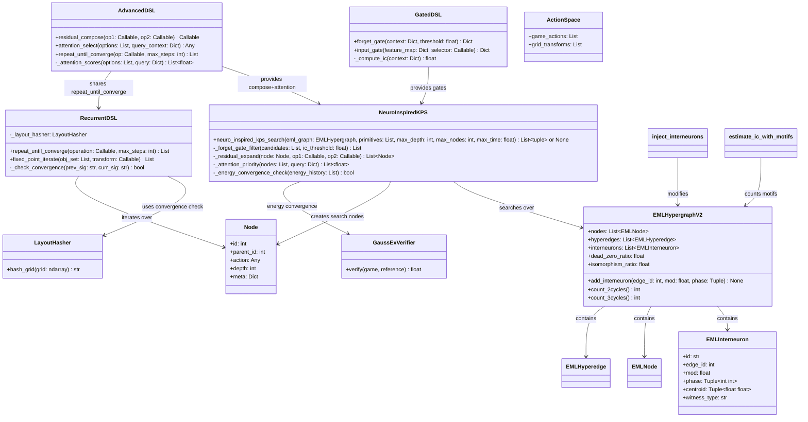
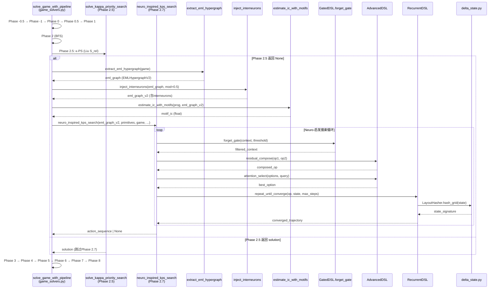
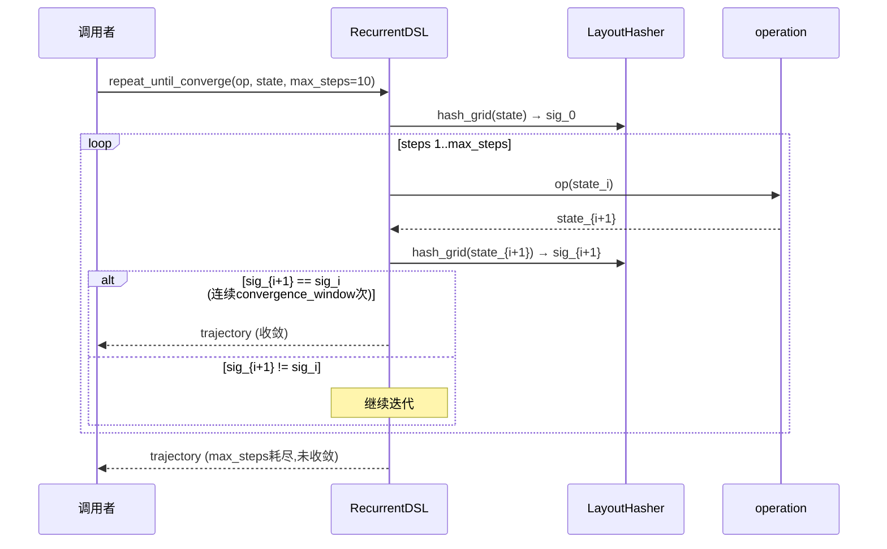
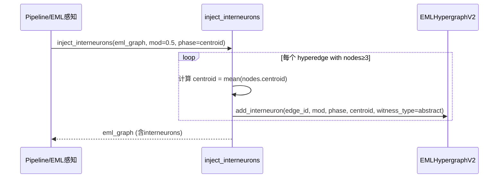
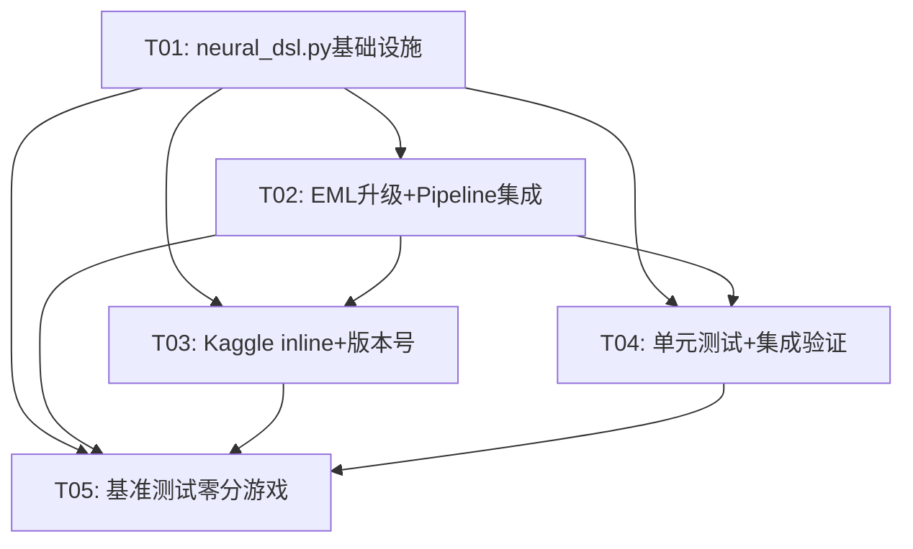

# TOMAS ARC-AGI-3 Solver v3.16.0 升级架构设计

> 架构师：高见远 (Gao)  
> 版本：v3.16.0  
> 基于：v3.15.3 → v3.16.0  
> 日期：2026-07-02  

---

## Part A: 系统设计

### 1. 实现方法

#### 核心技术挑战

| 挑战 | 说明 | 解决方案 |
|------|------|----------|
| **循环动力学与不动点收敛** | RecurrentDSL/fixed_point_iterate需要迭代到收敛，但ARC-3状态空间离散且无经典不动点 | 实现`repeat_until_converge`用`LayoutHasher`签名检测"状态不变"作为离散不动点；设置`max_steps=10`硬上限防止无限循环 |
| **神经启发DSL与κ-PS的融合** | `neuro_inspired_kps_search`需替换/增强Phase 2.5 κ-PS，但κ-PS已有Liu机制S_rel | 新增Phase 2.7（神经启发κ-PS），在Phase 2.5 κ-PS之后调用；若Phase 2.5返回None则升级为神经启发版本 |
| **EML中继节点注入** | `inject_interneurons`在三角形超边注入抽象witness节点，需修改EMLHypergraph数据结构 | 扩展EMLHypergraph namedtuple为可变class，新增`interneurons`字段；注入时机：EML感知后、对象级搜索前 |
| **Motif-based IC估计** | `estimate_ic_with_motifs`需计数2-cycle/3-cycle motif，依赖EML超图的拓扑结构 | 在EML超图提取后统计motif数量；IC估计公式：`base_ic + 0.2*n2cycles + 0.3*n3cycles` |
| **Kaggle inline膨胀控制** | v3.15.3 kaggle_my_agent.py已2540行，新增神经DSL类可能增加~400行 | 仅inline核心方法（forget_gate/input_gate/attention_select/residual_compose/repeat_until_converge），其余作为简化版内嵌 |

#### 框架与库选择

| 类别 | 选择 | 理由 |
|------|------|------|
| **DSL原语框架** | Python dataclass + namedtuple | 延续现有EMLNode/EMLHyperedge模式，无新依赖 |
| **优先队列** | heapq（已有） | neuro_inspired_kps_search使用与κ-PS相同的heapq模式 |
| **IC估计** | numpy（已有） | motif计数用numpy矩阵运算，无需graph库 |
| **收敛检测** | LayoutHasher（delta_state.py已有） | 重复利用现有签名机制 |
| **新增依赖** | 无 | v3.16.0不引入任何新pip包 |

#### 架构模式

- **策略模式(Strategy)**：RecurrentDSL/GatedDSL/AdvancedDSL作为可组合的搜索策略原语
- **装饰器模式(Decorator)**：neuro_inspired_kps_search装饰现有κ-PS，添加forget_gate/residual_compose/attention层
- **数据管道(Pipeline)**：延续现有Phase -0.5到Phase 8的pipeline架构，新增Phase 2.7

---

### 2. 文件布局

#### 新建文件

| 文件路径 | 说明 | 预估行数 |
|----------|------|----------|
| `src/agent/neural_dsl.py` | 神经启发DSL类集合（RecurrentDSL + GatedDSL + AdvancedDSL + neuro_inspired_kps_search + inject_interneurons + estimate_ic_with_motifs） | ~350行 |
| `tests/test_neural_dsl.py` | 神经DSL单元测试 | ~120行 |

#### 修改文件

| 文件路径 | 修改内容 | 预估新增行数 |
|----------|----------|--------------|
| `src/agent/__init__.py` | 导出v3.16.0新增类 | ~30行 |
| `src/agent/game_solvers.py` | (1) 新增Phase 2.7 neuro_inspired_kps调用 (2) 修改EMLHypergraph为可变class (3) inject_interneurons在EML感知后调用 | ~80行 |
| `src/agent/delta_state.py` | 新增fixed_point_iterate函数（复用LayoutHasher） | ~40行 |
| `kaggle_my_agent.py` | inline神经DSL核心方法 + 版本号升级 | ~200行 |
| `library.json` | 新增5个module + 5个macro + feature flags | ~60行 |

#### 文件关系图

```
src/agent/
├── neural_dsl.py          (NEW — v3.16.0 神经启发DSL)
│   ├── RecurrentDSL
│   ├── GatedDSL
│   ├── AdvancedDSL
│   ├── neuro_inspired_kps_search()
│   ├── inject_interneurons()
│   └── estimate_ic_with_motifs()
│
├── delta_state.py          (MODIFY — +fixed_point_iterate)
│   └── LayoutHasher (复用于收敛检测)
│   └── Node, ActionSpace, ReplayEngine
│
├── game_solvers.py         (MODIFY — +Phase 2.7, EML class升级)
│   ├── solve_kappa_priority_search (现有Phase 2.5)
│   ├── solve_game_with_pipeline (现有8-phase)
│   ├── extract_eml_hypergraph → EMLHypergraph升级
│   └── solve_eml_object_search
│
├── rhae_controller.py      (不变)
├── tomas_learner.py        (不变)
├── __init__.py             (MODIFY — +导出)
│
kaggle_my_agent.py          (MODIFY — +inline神经DSL)
library.json                (MODIFY — +schema升级)

tests/
└── test_neural_dsl.py      (NEW)
```

---

### 3. 数据结构与接口



#### 类详细签名

**RecurrentDSL** (`src/agent/neural_dsl.py`)
```python
class RecurrentDSL:
    """循环动力学DSL — RNN启发, repeat_until_converge原语
    
    核心思想: 对操作循环迭代直至状态签名不再变化(离散不动点)
    收敛检测: 使用LayoutHasher对状态网格做签名, 前后一致则收敛
    """
    
    def __init__(self, layout_hasher: LayoutHasher | None = None):
        self._layout_hasher = layout_hasher or LayoutHasher()
    
    def repeat_until_converge(
        self,
        operation: Callable[[Any], Any],
        initial_state: Any,
        max_steps: int = 10,
        convergence_window: int = 2,
    ) -> List[Any]:
        """循环执行operation直至收敛(离散不动点)。
        
        Args:
            operation: 状态变换函数 state -> new_state
            initial_state: 初始状态(game/grid)
            max_steps: 最大迭代次数(防止无限循环)
            convergence_window: 连续N步签名一致视为收敛
        
        Returns:
            状态演化轨迹列表 [state_0, state_1, ..., state_converged]
        """
        ...
    
    def fixed_point_iterate(
        self,
        obj_set: List[Any],
        transform: Callable[[List[Any]], List[Any]],
        global_condition: Callable[[List[Any]], bool],
        max_steps: int = 15,
    ) -> List[Any]:
        """对对象集合迭代变换直至全局条件满足(3-环协同演化)。
        
        Args:
            obj_set: 对象集合(EML节点列表)
            transform: 对象集合变换函数
            global_condition: 全局收敛判定函数
            max_steps: 最大迭代步数
        
        Returns:
            最终收敛的对象集合
        """
        ...
    
    def _check_convergence(self, prev_sig: str, curr_sig: str) -> bool:
        """比较前后状态签名是否一致"""
        return prev_sig == curr_sig
```

**GatedDSL** (`src/agent/neural_dsl.py`)
```python
class GatedDSL:
    """门控DSL — LSTM Forget Gate + Input Gate启发
    
    核心思想: IC低于threshold则保留旧记忆, 否则更新; 
    选择性注入特征到状态(input_gate)
    """
    
    def forget_gate(
        self,
        context: Dict[str, Any],
        threshold: float = 0.05,
    ) -> Dict[str, Any]:
        """LSTM Forget Gate: IC<threshold则保留旧context, 否则更新为新
        
        Args:
            context: 当前上下文字典 {ic: float, gex: float, state_sig: str, ...}
            threshold: IC阈值, 低于此值保留旧记忆
        
        Returns:
            过滤后的上下文 (保留或更新)
        """
        ic = self._compute_ic(context)
        if ic < threshold:
            # 保留旧记忆 — 低IC意味着已接近收敛, 不需要新信息
            return context
        else:
            # 更新记忆 — 高IC意味着还有信息增益空间
            return {k: v for k, v in context.items() if k != 'ic'} | {'ic': ic, 'retained': False}
    
    def input_gate(
        self,
        feature_map: Dict[str, Any],
        selector: Callable[[Dict], List[str]],
    ) -> Dict[str, Any]:
        """LSTM Input Gate: 选择性注入特征到状态
        
        Args:
            feature_map: 可用特征字典 {eml_nodes: ..., motifs: ..., ...}
            selector: 特征选择函数, 返回要注入的key列表
        
        Returns:
            精选后的特征子集
        """
        selected_keys = selector(feature_map)
        return {k: feature_map[k] for k in selected_keys if k in feature_map}
    
    def _compute_ic(self, context: Dict) -> float:
        """从上下文计算IC值"""
        return context.get('ic', 0.0)
```

**AdvancedDSL** (`src/agent/neural_dsl.py`)
```python
class AdvancedDSL:
    """高级DSL — ResNet残差 + Transformer Attention启发
    
    residual_compose: F(x)+x残差连接, base+residual
    attention_select: attention_score→argmax最优操作
    repeat_until_converge: RNN启发(与RecurrentDSL共享接口)
    """
    
    def residual_compose(
        self,
        op1: Callable[[Any], Any],
        op2: Callable[[Any], Any],
    ) -> Callable[[Any], Any]:
        """ResNet启发: F(x)+x残差连接
        
        Args:
            op1: 基础变换(base operation)
            op2: 残差变换(residual operation)
        
        Returns:
            组合函数: lambda x: op1(x) + op2(x) 的效果
            实际实现: op1先执行, op2在op1结果上执行残差修正
        """
        def composed(state):
            base_result = op1(state)
            residual = op2(base_result)
            # 残差连接: base + residual
            return self._merge_states(base_result, residual)
        return composed
    
    def attention_select(
        self,
        options: List[Any],
        query_context: Dict[str, Any],
    ) -> Any:
        """Transformer启发: attention_score→argmax最优操作
        
        Args:
            options: 可选操作列表
            query_context: 查询上下文 {ic: float, gex: float, ...}
        
        Returns:
            attention_score最高的选项
        """
        scores = self._attention_scores(options, query_context)
        best_idx = max(range(len(scores)), key=lambda i: scores[i])
        return options[best_idx]
    
    def repeat_until_converge(
        self,
        op: Callable[[Any], Any],
        initial_state: Any,
        max_steps: int = 10,
    ) -> List[Any]:
        """RNN启发循环原语 — 同RecurrentDSL接口"""
        recurrent = RecurrentDSL()
        return recurrent.repeat_until_converge(op, initial_state, max_steps)
    
    def _attention_scores(
        self,
        options: List[Any],
        query: Dict[str, Any],
    ) -> List[float]:
        """计算attention scores: score_i = sim(option_i, query)"""
        q_ic = query.get('ic', 0.0)
        q_gex = query.get('gex', 0.0)
        scores = []
        for opt in options:
            # 简化attention: IC越高+GEX越低 → score越高
            opt_ic = opt.get('ic', 0.0) if isinstance(opt, dict) else 0.0
            opt_gex = opt.get('gex', 1.0) if isinstance(opt, dict) else 1.0
            score = opt_ic / (opt_gex + 0.01)  # IC/GEX ratio
            scores.append(score)
        return scores
    
    def _merge_states(self, base: Any, residual: Any) -> Any:
        """合并base和residual状态"""
        if isinstance(base, dict) and isinstance(residual, dict):
            merged = dict(base)
            for k, v in residual.items():
                if k in merged and isinstance(merged[k], (int, float)):
                    merged[k] = merged[k] + v  # 残差相加
                else:
                    merged[k] = v  # 覆盖
            return merged
        # 对于game/grid对象, residual作为修正步骤追加
        return residual  # fallback: residual优先
```

**neuro_inspired_kps_search** (`src/agent/neural_dsl.py`)
```python
def neuro_inspired_kps_search(
    eml_graph: EMLHypergraphV2,
    primitives: List[Callable],
    game: Any,
    max_depth: int = 40,
    max_nodes: int = 500000,
    max_time: float = 30.0,
    ic_threshold: float = 0.05,
    forget_threshold: float = 0.05,
    energy_convergence_window: int = 3,
) -> list[tuple] | None:
    """神经启发κ-PS搜索算法
    
    完整搜索流程:
    1. PriorityQueue(IC优先) — 高IC节点优先扩展
    2. forget_gate剪枝 — IC<threshold的候选被保留(不丢弃), 高IC候选被更新
    3. residual_compose扩展 — op1(base) + op2(residual) = 新状态
    4. attention_score优先级 — sim(option, query) → argmax
    5. energy收敛检查 — 连续N步GEX变化<ε → 可能收敛
    
    与现有κ-PS(Phase 2.5)的关系:
    - Phase 2.5: Liu机制S_rel = 1/(S_rel+ε), 经典优先队列
    - Phase 2.7(本函数): 在Liu机制基础上叠加神经启发层
    - 若Phase 2.5已找到解, Phase 2.7不执行
    - 若Phase 2.5返回None, Phase 2.7启动
    
    Args:
        eml_graph: EML超图(含interneurons)
        primitives: DSL原语列表
        game: 游戏对象
        max_depth: 最大搜索深度
        max_nodes: 最大节点数
        max_time: 时间限制(秒)
        ic_threshold: forget_gate IC阈值
        forget_threshold: forget_gate保留阈值
        energy_convergence_window: 收敛检测窗口
    
    Returns:
        动作序列列表 [(GameAction, data), ...], 或None
    """
    ...
```

**inject_interneurons** (`src/agent/neural_dsl.py`)
```python
def inject_interneurons(
    eml_graph: EMLHypergraphV2,
    mod: float = 0.5,
    phase_mode: str = 'centroid',
) -> EMLHypergraphV2:
    """EML超图中继节点注入
    
    在三角形关系边(≥3 nodes)注入抽象witness节点
    
    算法:
    1. 扫描所有hyperedge, 找node_count≥3的三角形边
    2. 对每个三角形边, 计算centroid=(mod, phase)坐标
       - mod = 0.5: 中继节点在拓扑空间的1/2位置
       - phase = centroid: 中继节点位于物理centroid
    3. 创建EMLInterneuron(id, edge_id, mod, phase, centroid, witness_type)
    4. 添加到eml_graph.interneurons列表
    
    Args:
        eml_graph: EML超图(将被修改)
        mod: 中继节点拓扑位置系数 (默认0.5)
        phase_mode: 坐标计算模式 ('centroid' | 'boundary')
    
    Returns:
        修改后的EMLHypergraphV2(含interneurons)
    """
    ...
```

**estimate_ic_with_motifs** (`src/agent/neural_dsl.py`)
```python
def estimate_ic_with_motifs(
    prog_fragment: Any,
    eml_graph: EMLHypergraphV2,
    base_ic: float = 0.0,
) -> float:
    """Motif-based IC估计
    
    公式: IC = base_ic + 0.2 × n2cycles + 0.3 × n3cycles
    
    2-cycle: 两个EML节点之间的双向关系(A↔B)
    3-cycle: 三个EML节点之间的循环关系(A→B→C→A)
    
    Args:
        prog_fragment: 程序片段(用于base_ic计算)
        eml_graph: EML超图(用于motif计数)
        base_ic: 基础IC值
    
    Returns:
        motif-adjusted IC值
    """
    n2cycles = eml_graph.count_2cycles()
    n3cycles = eml_graph.count_3cycles()
    return base_ic + 0.2 * n2cycles + 0.3 * n3cycles
```

---

### 4. 程序调用流程



#### RecurrentDSL.repeat_until_converge 内部流程



#### inject_interneurons 内部流程



---

### 5. 待明确事项

| # | 事项 | 当前假设 | 需要确认 |
|---|------|----------|----------|
| 1 | **RecurrentDSL收敛定义** | 状态签名连续2步一致视为收敛(离散不动点) | 是否需要更严格的收敛条件(如GEX变化率<ε)? |
| 2 | **Phase 2.7 vs Phase 2.5的关系** | Phase 2.7仅在Phase 2.5失败时执行 | 是否应该Phase 2.7替代Phase 2.5而非并行? |
| 3 | **neuro_inspired_kps_search的primitives来源** | 使用现有ActionSpace.game_actions/grid_transforms | 是否需要定义新的DSL原语列表? |
| 4 | **kaggle_my_agent.py inline策略** | 仅inline核心方法(5个), 约200行 | 是否需要完整inline所有neural_dsl.py类? |
| 5 | **EMLHypergraph从namedtuple升级为class** | 保持向后兼容, namedtuple字段映射到class属性 | 是否影响kaggle_my_agent.py中的inline EML代码? |
| 6 | **library.json新增macro的dsl_sequence格式** | 延续现有abstractions[].dsl_sequence格式 | 新增"repeat_until_converge"原语如何在JSON中表示? |

---

## Part B: 任务分解

### 6. Required Packages

v3.16.0 **不引入任何新pip包**。所有实现基于现有依赖：

```
- numpy: 已有, motif计数和attention_score计算
- heapq: 已有, neuro_inspired_kps_search优先队列
- collections.namedtuple/dataclasses: 已有, EML数据结构
- math: 已有, IC/GEX计算
- copy: 已有, game deepcopy
- time: 已有, 搜索超时控制
```

### 7. Task List (ordered by dependency)

| Task ID | Task Name | Source Files | Dependencies | Priority | Description |
|---------|-----------|-------------|-------------|----------|-------------|
| T01 | **项目基础设施：neural_dsl.py + 数据结构定义** | `src/agent/neural_dsl.py` (新建), `src/agent/delta_state.py` (修改+fixed_point_iterate), `src/agent/__init__.py` (修改+导出) | 无 | P0 | 创建neural_dsl.py, 包含RecurrentDSL/GatedDSL/AdvancedDSL三个DSL类 + neuro_inspired_kps_search/inject_interneurons/estimate_ic_with_motifs三个函数; delta_state.py新增fixed_point_iterate; __init__.py导出所有v3.16.0新增类 |
| T02 | **EML超图升级 + Pipeline集成** | `src/agent/game_solvers.py` (修改: EMLHypergraph→EMLHypergraphV2 class + Phase 2.7 + inject调用点), `src/agent/neural_dsl.py` (依赖) | T01 | P0 | (1) EMLHypergraph namedtuple升级为EMLHypergraphV2 dataclass, 新增interneurons字段和count_2cycles/count_3cycles方法 (2) solve_game_with_pipeline新增Phase 2.7, 在Phase 2.5 κ-PS返回None后调用neuro_inspired_kps_search (3) EML感知后调用inject_interneurons |
| T03 | **Kaggle inline + 版本号升级** | `kaggle_my_agent.py` (修改: +inline神经DSL核心方法 + 版本号), `library.json` (修改: +schema升级) | T01, T02 | P1 | (1) kaggle_my_agent.py inline 5个核心方法(forget_gate/input_gate/attention_select/residual_compose/repeat_until_converge)约200行 (2) 版本号v3.15.3→v3.16.0 (3) library.json schema升级: _schema_version→3.16.0, 新增5个core_modules, 新增5个feature_flags |
| T04 | **单元测试 + 集成验证** | `tests/test_neural_dsl.py` (新建), `src/agent/neural_dsl.py` (被测), `src/agent/game_solvers.py` (集成测试) | T01, T02 | P1 | (1) test_neural_dsl.py: RecurrentDSL收敛测试, GatedDSL门控测试, AdvancedDSL残差/attention测试, neuro_inspired_kps_search集成测试 (2) Pipeline Phase 2.7集成验证 (3) EMLHypergraphV2兼容性测试 |
| T05 | **基准测试：ka59/ar25/tn36零分游戏** | 基准测试脚本(使用现有benchmark框架), `src/agent/game_solvers.py` (被测), `src/agent/neural_dsl.py` (被测) | T01, T02, T03, T04 | P2 | 在ka59/ar25/tn36三个零分游戏上验证v3.16.0神经启发搜索是否改善得分; 对比v3.15.3 vs v3.16.0 RHAE; 记录Phase 2.7命中率 |

### Task Dependency Graph



---

### 8. Shared Knowledge

```
- 版本号: v3.16.0 (从v3.15.3升级, PR式递进)
- 所有新增类在 src/agent/neural_dsl.py
- 所有新增函数在 src/agent/neural_dsl.py (顶层函数)
- import约定: from .neural_dsl import RecurrentDSL, GatedDSL, AdvancedDSL, ...
- EMLHypergraphV2向后兼容: namedtuple字段(nodes, hyperedges, dead_zero_ratio, isomorphism_ratio) 
  映射到dataclass同名属性; 新增interneurons字段默认为[]
- IC估计公式: IC = base_ic + 0.2 × n2cycles + 0.3 × n3cycles
- forget_gate阈值: ic_threshold = 0.05 (与现有psi_cut_ic_threshold一致)
- convergence检测: LayoutHasher签名连续2步一致 = 收敛
- Phase 2.7仅在Phase 2.5返回None时执行 (不替代, 是增强)
- kaggle_my_agent.py inline策略: 5个核心方法简化版, 约200行
- library.json _schema_version: "3.16.0"
- 新增core_modules: recurrent_dsl, gated_dsl, advanced_dsl, neuro_inspired_kps, interneuron_injection
- 新增feature_flags: recurrent_dsl_enabled, gated_dsl_enabled, advanced_dsl_enabled, 
  neuro_inspired_kps_enabled, interneuron_injection_enabled
- 新增macros: repeat_until_converge, forget_gate_filter, residual_compose, attention_select, motif_ic_estimate
```

---

### 9. 任务详细JSON

```json
[
  {
    "id": 1,
    "task": "创建neural_dsl.py基础设施",
    "files": ["src/agent/neural_dsl.py", "src/agent/delta_state.py", "src/agent/__init__.py"],
    "depends_on": [],
    "description": "新建src/agent/neural_dsl.py(~350行), 包含RecurrentDSL(repeat_until_converge+fixed_point_iterate)/GatedDSL(forget_gate+input_gate)/AdvancedDSL(residual_compose+attention_select+repeat_until_converge)/neuro_inspired_kps_search/inject_interneurons/estimate_ic_with_motifs; delta_state.py新增fixed_point_iterate辅助函数(复用LayoutHasher); __init__.py新增v3.16.0导出块"
  },
  {
    "id": 2,
    "task": "EML超图升级 + Pipeline Phase 2.7集成",
    "files": ["src/agent/game_solvers.py", "src/agent/neural_dsl.py"],
    "depends_on": [1],
    "description": "(1) game_solvers.py: EMLHypergraph namedtuple升级为EMLHypergraphV2 dataclass, 新增interneurons/EMLInterneuron/count_2cycles/count_3cycles/add_interneuron; (2) extract_eml_hypergraph返回EMLHypergraphV2; (3) solve_game_with_pipeline新增Phase 2.7: Phase 2.5返回None后调用neuro_inspired_kps_search; (4) EML感知后调用inject_interneurons; (5) solve_eml_object_search使用estimate_ic_with_motifs替代旧IC估计"
  },
  {
    "id": 3,
    "task": "Kaggle inline升级 + library.json schema升级",
    "files": ["kaggle_my_agent.py", "library.json"],
    "depends_on": [1, 2],
    "description": "(1) kaggle_my_agent.py: inline 5个核心方法—_forget_gate_inline/_input_gate_inline/_attention_select_inline/_residual_compose_inline/_repeat_until_converge_inline, 约200行; 版本号v3.15.3→v3.16.0; (2) library.json: _schema_version→3.16.0; _tomas_framework.version→3.16.0; 新增5个core_modules(recurrent_dsl/gated_dsl/advanced_dsl/neuro_inspired_kps/interneuron_injection); 新增5个feature_flags; 新增5个macros在abstractions[]"
  },
  {
    "id": 4,
    "task": "单元测试 + 集成验证",
    "files": ["tests/test_neural_dsl.py", "src/agent/neural_dsl.py", "src/agent/game_solvers.py"],
    "depends_on": [1, 2],
    "description": "(1) 新建test_neural_dsl.py: RecurrentDSL收敛测试(模拟Flood Fill)/GatedDSL forget_gate阈值测试/AdvancedDSL residual_compose+attention_select测试/neuro_inspired_kps_search最小集成测试; (2) EMLHypergraphV2兼容性测试(namedtuple→dataclass迁移); (3) Pipeline Phase 2.7调用链验证"
  },
  {
    "id": 5,
    "task": "基准测试：ka59/ar25/tn36零分游戏验证",
    "files": ["基准测试脚本(使用现有benchmark框架)", "src/agent/game_solvers.py", "src/agent/neural_dsl.py"],
    "depends_on": [1, 2, 3, 4],
    "description": "在ka59/ar25/tn36三个零分游戏上运行v3.16.0; 对比v3.15.3 vs v3.16.0 RHAE得分; 记录Phase 2.7命中率; 检查RecurrentDSL收敛率; 检查inject_interneurons对EML拓扑的影响"
  }
]
```

---

### Pipeline集成点详细说明

| 集成点 | 位置 | 触发条件 | 说明 |
|--------|------|----------|------|
| **Phase 2.7: neuro_inspired_kps_search** | `game_solvers.py` solve_game_with_pipeline, Phase 2.5之后 | Phase 2.5 κ-PS返回None | 新增Phase编号2.7, 在Phase 2.5和Phase 3之间 |
| **RecurrentDSL.repeat_until_converge** | Phase 2.7内部 + Phase 0.5 Fast-Path DSL原语 | neuro_inspired_kps_search内部循环 + Fast-Path新增repeat原语 | 作为DSL原语, 可被Fast-Path Dispatcher识别 |
| **inject_interneurons** | `game_solvers.py` extract_eml_hypergraph后, solve_eml_object_search前 | EML感知完成后 | 修改EMLHypergraph, 注入中继节点后再做对象级搜索 |
| **GatedDSL.forget_gate** | Phase 2.7内部 | neuro_inspired_kps_search扩展候选时 | 剪枝低IC候选(保留旧记忆) |
| **GatedDSL.input_gate** | Phase 2.7内部 | neuro_inspired_kps_search注入新特征时 | 选择性注入EML motif信息 |
| **AdvancedDSL.residual_compose** | Phase 2.7内部 | neuro_inspired_kps_search扩展新节点时 | op1(base)+op2(residual)组合变换 |
| **AdvancedDSL.attention_select** | Phase 2.7内部 | neuro_inspired_kps_search优先级排序时 | attention_score→argmax最优操作 |
| **estimate_ic_with_motifs** | Phase 2.7内部 + EML感知后 | IC估计替代旧方法 | IC = base_ic + 0.2×n2cycles + 0.3×n3cycles |
| **fixed_point_iterate** | Phase 2.7内部 | 对象集合协同演化 | 对EML节点集合迭代直至全局条件满足 |

### kaggle_my_agent.py inline策略详细说明

| inline方法 | 来源 | 预估行数 | 简化方式 |
|------------|------|----------|----------|
| `_forget_gate_inline` | GatedDSL.forget_gate | ~25行 | 仅保留IC阈值判断, 无selector |
| `_input_gate_inline` | GatedDSL.input_gate | ~15行 | 仅保留IC/GEX特征注入 |
| `_attention_select_inline` | AdvancedDSL.attention_select | ~20行 | IC/GEX ratio简化attention |
| `_residual_compose_inline` | AdvancedDSL.residual_compose | ~15行 | 仅dict合并, 无game/grid复杂合并 |
| `_repeat_until_converge_inline` | RecurrentDSL.repeat_until_converge | ~30行 | 使用grid哈希签名检测收敛 |
| **总计** | | **~105行** | |

> 注: inject_interneurons和estimate_ic_with_motifs不需要完整inline, 
> 因为kaggle_my_agent.py已有`_extract_eml_hypergraph_inline`方法,
> 只需在该方法中添加interneuron注入和motif计数约~30行。

### library.json schema升级详细说明

```json
// 新增 core_modules (5个)
"recurrent_dsl",           // RecurrentDSL repeat_until_converge/fixed_point_iterate
"gated_dsl",               // GatedDSL forget_gate/input_gate
"advanced_dsl",            // AdvancedDSL residual_compose/attention_select
"neuro_inspired_kps",      // neuro_inspired_kps_search
"interneuron_injection"    // inject_interneurons + EMLInterneuron

// 新增 feature_flags (5个)
"recurrent_dsl_enabled": true,
"gated_dsl_enabled": true,
"advanced_dsl_enabled": true,
"neuro_inspired_kps_enabled": true,
"interneuron_injection_enabled": true

// 新增 macros (5个, 在 abstractions[] 中)
{
  "name": "macro_repeat_until_converge",
  "dsl_sequence": [{"action": "REPEAT_UNTIL_CONVERGE", "operation": "...", "max_steps": 10}],
  ...
},
{
  "name": "macro_forget_gate_filter",
  "dsl_sequence": [{"action": "FORGET_GATE", "threshold": 0.05}],
  ...
},
{
  "name": "macro_residual_compose",
  "dsl_sequence": [{"action": "RESIDUAL_COMPOSE", "op1": "...", "op2": "..."}],
  ...
},
{
  "name": "macro_attention_select",
  "dsl_sequence": [{"action": "ATTENTION_SELECT", "query_context": "..."}],
  ...
},
{
  "name": "macro_motif_ic_estimate",
  "dsl_sequence": [{"action": "MOTIF_IC_ESTIMATE", "base_ic": 0.0}],
  ...
}
```

---

## 附录：版本号约定

```
v3.15.3 → v3.16.0  (功能版本升级, 不是patch)
  - 3: 大版本(ARC-AGI-3竞赛框架)
  - 16: 功能版本(神经启发DSL层)
  - 0: 子版本(首次发布)

后续可能:
  v3.16.1: bugfix / 参数调优
  v3.16.2: 零分游戏得分改善
  v3.17.0: 下一个大功能版本
```
